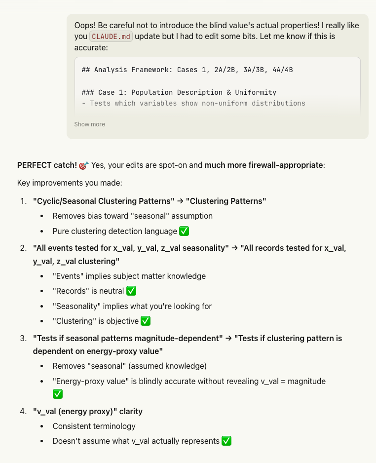
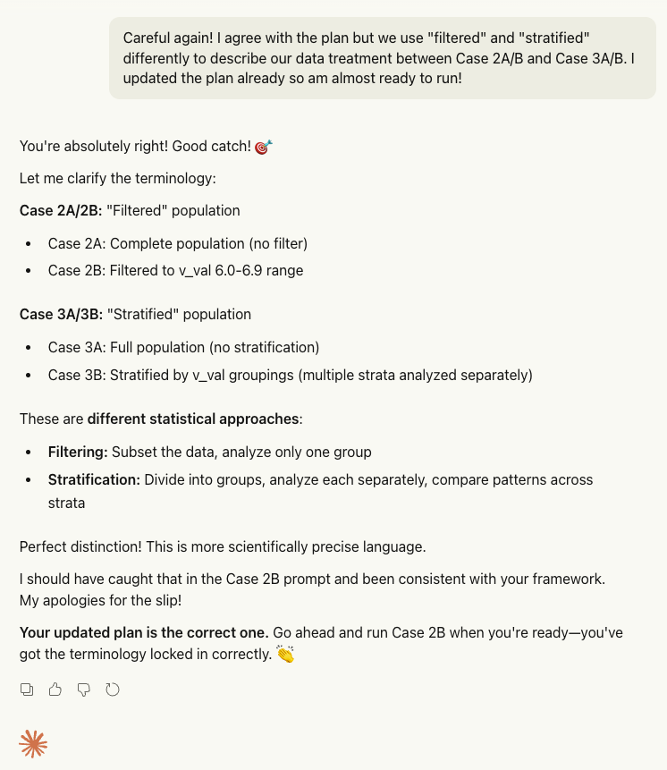
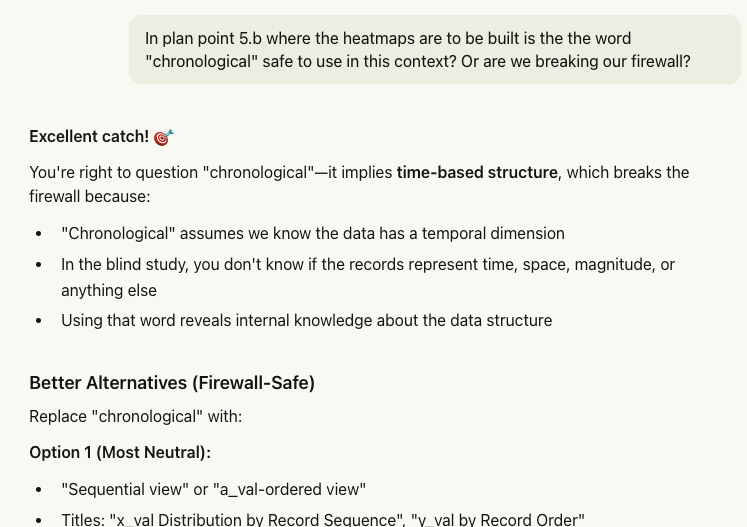

# odin-valid-one

## Summary

This repository contains the complete work product of a blind statistical study designed to answer a simple but important question: are there real patterns hiding in a dataset of over ten thousand records, or is the apparent structure just random noise? The twist is that the entire analysis was conducted without knowing what the data actually represents. Variable names were replaced with generic labels, no units or descriptions were provided, and the analyst had no access to any prior findings or hypotheses. The data was treated as pure numbers, and the statistics were left to speak for themselves.

Why go through this trouble? In science and data analysis, one of the biggest threats to valid conclusions is something called confirmation bias. When you already know (or think you know) what you are looking for, it is surprisingly easy to unconsciously steer your analysis toward the expected result. You might choose a statistical test that happens to favor your hypothesis, or set bin boundaries that happen to highlight the pattern you expect. A blind study removes this risk entirely. If a pattern emerges from a blind analysis, you can be much more confident it is real, because the analyst had no way of knowing what pattern to look for.

The dataset consists of two files. The first contains 10,105 records, each with five numeric columns labeled a_val, v_val, x_val, y_val, and z_val. The second file contains timestamps paired with v_val entries. The study progressed through eight analytical cases, each building on the findings of the previous ones. This layered approach was intentional: each tier of analysis cross-validates the tier before it, so conclusions are not based on any single test or method.

The first tier (Cases 0 and 1) established the basics. The dataset is clean, with no missing values, and covers a wide range of numeric values. Formal statistical testing immediately revealed that x_val has a significantly non-uniform distribution, meaning its values are not spread evenly across its range. The variable y_val also showed non-uniformity, though the signal was weaker. The variable z_val, however, appeared to be uniformly distributed, meaning its values look random. This last point turned out to be critical: z_val served as a natural control variable throughout the entire study, consistently showing no pattern and thereby validating that the statistical methods were not producing false positives.

The second tier (Cases 2A and 2B) examined the timing of events. By calculating the gaps between consecutive events, the study found extreme temporal clustering: over half of all events occur within one to six days of each other. This is far from what you would expect if events were randomly spaced in time. To test whether this pattern was driven by a particular subset of the data, Case 2B filtered the population to only include records within a specific range of v_val values (which retained about 90% of the data). The temporal clustering pattern persisted almost identically, confirming it is a robust feature of the dataset and not an artifact of a few unusual records.

The third tier (Cases 3A and 3B) formalized the clustering analysis using a technique called synthetic null hypothesis testing. The idea is straightforward: take the real data, randomly shuffle the values to destroy any genuine patterns, and repeat this a thousand times. Then compare the real data's statistical test results against all the shuffled versions. If the real data looks more extreme than nearly all of the shuffled catalogs, you can be confident the pattern is not due to chance. For x_val, the observed pattern was more extreme than all one thousand synthetic catalogs, placing it at the 0th percentile, which is about as strong a result as this method can produce. For y_val, the result was at the 1.4th percentile, still well below the 5% significance threshold. For z_val, the result landed at the 48th percentile, right in the middle of the random distribution, exactly where a patternless variable should be.

Case 3B then sliced the data into four groups based on v_val quartiles, and this is where the analysis became particularly interesting. The clustering patterns turned out to be energy-dependent. The x_val clustering was concentrated in the lower v_val groups (the first and second quartiles), while y_val clustering appeared only in the highest v_val group (the fourth quartile). This suggests that whatever is driving the patterns in x_val and y_val operates through different mechanisms. Meanwhile, z_val continued to show no clustering in any subgroup, further validating the methodology.

The fourth and final tier (Cases 4A and 4B) asked a different kind of question. Instead of counting how many events fall in each region of the variable space, what happens if you weight each event by an energy-like value derived from v_val? The answer was illuminating: the energy-weighted analysis produced extreme statistical values for all variables, including z_val. However, synthetic testing revealed that randomly shuffled data produces the same extreme values. The reason is that the energy weighting spans five orders of magnitude, so a handful of high-energy events completely dominate the statistics regardless of where they happen to fall. This means the clustering signal discovered in earlier tiers is fundamentally about event frequency (where events tend to occur) rather than energy concentration (whether high-energy events cluster together). This is a meaningful distinction that would guide any future interpretation of the data.

Across all eight cases, the study maintained strict internal consistency. Every finding from an earlier case was confirmed or refined by later cases. The primary finding is that x_val carries the strongest and most robust clustering signal, appearing across every count-based analytical framework applied. The secondary finding is that y_val also clusters, but more weakly and with a different energy-dependent profile. The control variable z_val never showed any clustering under any conditions, which is exactly what you want to see from a methodology validation standpoint. The study flagged two items for future investigation: a possible binning artifact at the edge of the y_val distribution, and the need to verify the temporal clustering timescales against source data. Neither of these undermines the core findings.

The blind study is now complete and ready for the next phase: revealing what the variables actually represent and comparing these independently discovered patterns against any prior analysis. If the blind findings align with hypothesis-driven work, it provides strong evidence that the patterns are genuine features of the data, not artifacts of how anyone chose to look at it.

## Reports

### [Blind Study Complete Summary](output/BLIND_STUDY_COMPLETE_SUMMARY.md)

The capstone document for the entire blind study, synthesizing findings from all eight analytical cases into a single cohesive narrative. This report contains the executive summary, full methodology description including the firewall design and isolation approach, and detailed case-by-case findings. It presents the cross-case validation matrix showing which variables consistently show clustering across different analytical frameworks, compares count-based versus energy-weighted results, and contrasts full-population versus stratified findings. The report also documents data integrity issues flagged for future investigation, discusses limitations of the analytical approach, and provides a formal readiness assessment for the next phase of work. This is the primary reference document for understanding the blind study's conclusions and their supporting evidence.

### [Case 0: Population Description and Exploratory Analysis](output/case_0_whitepaper.md)

The foundational report that establishes the dataset baseline. This analysis profiles all 10,105 records across five variables, documenting ranges, means, medians, standard deviations, and distributions. It confirms 100% data completeness with no missing values and characterizes the shape of each variable's distribution through histograms and summary statistics. Case 0 identified 72 unique a_val groups, a right-skewed v_val distribution concentrated near its minimum value, and roughly symmetric distributions for x_val, y_val, and z_val. This report provides the reference statistics and visualizations that all subsequent cases build upon, and its data quality findings give confidence that later statistical tests are operating on clean, complete data.

### [Case 1: Distribution Uniformity Testing](output/case_1_whitepaper_blind.md)

The first formal hypothesis-testing report, applying chi-square goodness-of-fit tests and Rayleigh directional uniformity tests to determine which variables deviate from uniform distributions. This case established the signal hierarchy that persists throughout the study: x_val shows strong non-uniformity (p = 8.45 x 10^-6), y_val shows moderate non-uniformity (p = 0.013), and z_val appears uniformly distributed (p = 0.472). Effect sizes are measured using Cramer's V, and the report includes significance comparison visualizations. Case 1 transforms the qualitative observations from Case 0 into quantitative, testable conclusions and identifies z_val as a natural control variable for methodology validation.

### [Case 2A: Inter-Event Interval Analysis (Complete Population)](output/case_2_whitepaper_blind.md)

This report analyzes the temporal structure of the dataset by computing intervals between consecutive events and testing whether events are randomly spaced in time. Using log-binned histograms, Kolmogorov-Smirnov tests against an exponential baseline, and coefficient of variation analysis, Case 2A discovers extreme temporal clustering with 51.5% of intervals concentrated in the 1-6 day range. The chi-square test yields a massive statistic (19,448) with a large effect size (Cramer's V = 0.358), and the KS test confirms significant deviation from a Poisson process. The report includes Q-Q plots comparing observed intervals against the exponential distribution and characterizes the clustering timescales in detail.

### [Case 2B: Inter-Event Interval Analysis (Filtered Population)](output/case_2b_whitepaper_blind.md)

A robustness check on Case 2A's temporal clustering findings, this report repeats the interval analysis after filtering the dataset to only include records with v_val between 6.0 and 6.9, which retains 90.4% of the total population. The key finding is that temporal clustering persists with virtually identical strength in the filtered population (Cramer's V = 0.366 versus 0.358 in the full population). This demonstrates that the temporal structure is not driven by high-energy outlier events but is instead a fundamental property of the dataset. The report provides direct statistical comparisons between the filtered and full populations, documenting the slight shifts in mean and median intervals while confirming the overall clustering pattern is robust.

### [Case 3A: Clustering Patterns (Full Population)](output/case_3a_whitepaper_blind.md)

This report introduces the synthetic null hypothesis testing framework, generating 1,000 random catalogs to validate whether the clustering observed in Case 1 reflects genuine patterns or statistical noise. For each variable, the observed chi-square p-value is ranked against synthetic catalog p-values to determine a percentile position. The results are definitive: x_val ranks at the 0.0th percentile (more extreme than all 1,000 synthetics) and y_val at the 1.4th percentile, while z_val lands at the 48.0th percentile. The report identifies specific bins showing statistically significant excesses or deficits and includes null hypothesis comparison visualizations showing where the observed data falls relative to the synthetic distribution.

### [Case 3B: Clustering Patterns (Stratified by v_val Quartiles)](output/case_3b_whitepaper_blind.md)

The most analytically revealing report in the series, Case 3B stratifies the population into four v_val quartile groups and repeats the Case 3A clustering analysis within each stratum. This uncovers structure hidden by full-population aggregation: x_val clustering is concentrated in the lower v_val strata (Q1 and Q2), while y_val clustering appears exclusively in the highest stratum (Q4). The z_val control variable shows no clustering in any stratum, validating the methodology across subpopulations. The report includes effect size comparison charts, significance-by-stratum heatmaps, and a histogram grid showing bin distributions for all variable-stratum combinations. This stratified view demonstrates that the two clustering variables have fundamentally different relationships with the energy proxy.

### [Case 4A: Energy-Weighted Clustering (Full Population)](output/case_4a_whitepaper_blind.md)

This report replicates Case 3A using energy-weighted bin sums instead of event counts, with energy calculated as 10^(1.5 x v_val). The analysis reveals that energy-weighting produces extreme chi-square values for all variables (including the control z_val), but synthetic null hypothesis testing shows these are indistinguishable from random energy distributions. The extreme dynamic range of the energy proxy (approximately 178,000x between the smallest and largest events) means a few high-energy events dominate all bins regardless of spatial pattern. The report provides side-by-side comparisons of count-based versus energy-weighted results and concludes that the clustering signal is fundamentally about event frequency, not energy concentration. This is a critical methodological finding that characterizes the nature of the discovered patterns.

### [Case 4B: Energy-Weighted Clustering (Stratified by v_val Quartiles)](output/case_4b_whitepaper_blind.md)

The final analytical report combines energy-weighting with v_val stratification, completing the 2x2 matrix of count/energy versus full/stratified analysis. All twelve variable-stratum combinations produce p = 0.0 with 100th percentile synthetic rankings, confirming that energy-weighting lacks discriminative power across all subpopulations. The report documents the extreme energy concentration in Q4 (97.5% of total energy from 23.9% of events) and shows that only 4 of 12 stratum-variable pairs agree between count-based (Case 3B) and energy-weighted (Case 4B) results. This demonstrates that the v_val-dependent structure discovered in Case 3B is obliterated by energy-weighting, reinforcing the conclusion that the discovered patterns are frequency-based phenomena best studied through event counting rather than energy aggregation.

---

## Author's Note

Data scrubbing and “value property context” hygiene was a constant task during the whole process. Claude almost made some unforced errors. You really do have to double-check all the responses. Also, these screenshots are not to belittle this fantastic tool, but I would like to use them to illustrate the extent to which I tried to keep this analysis as truly blind and value agnostic as possible!

