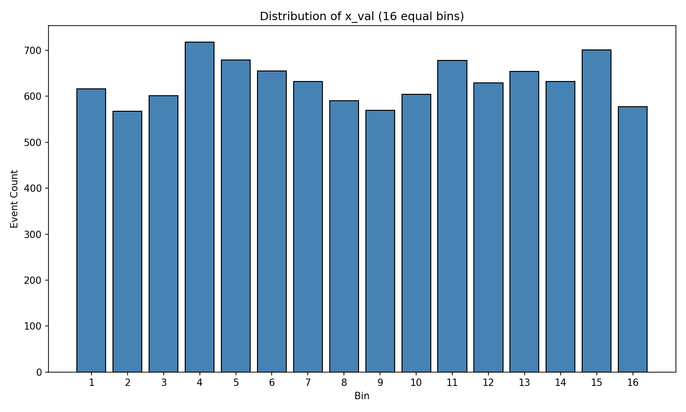
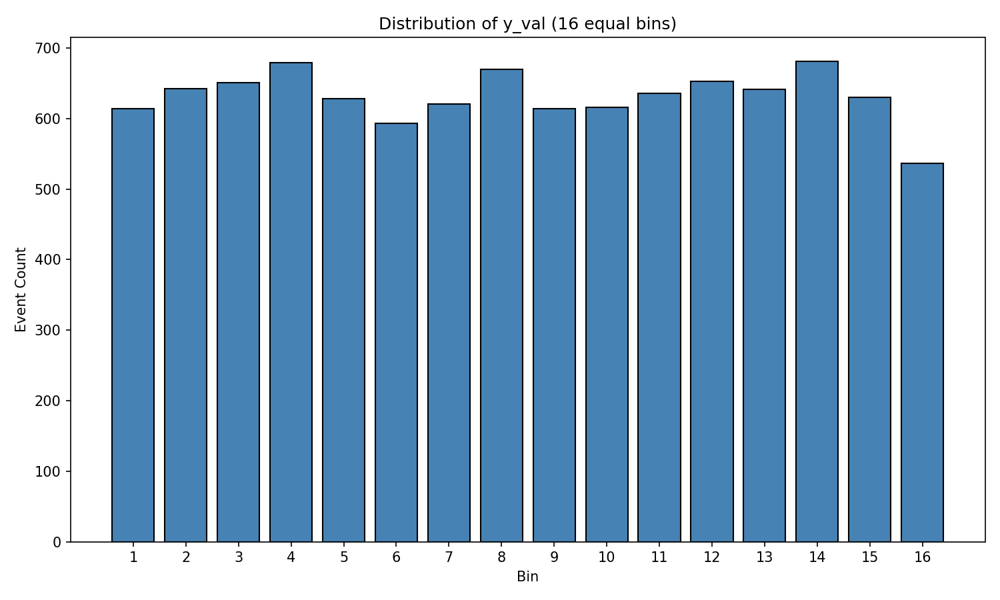
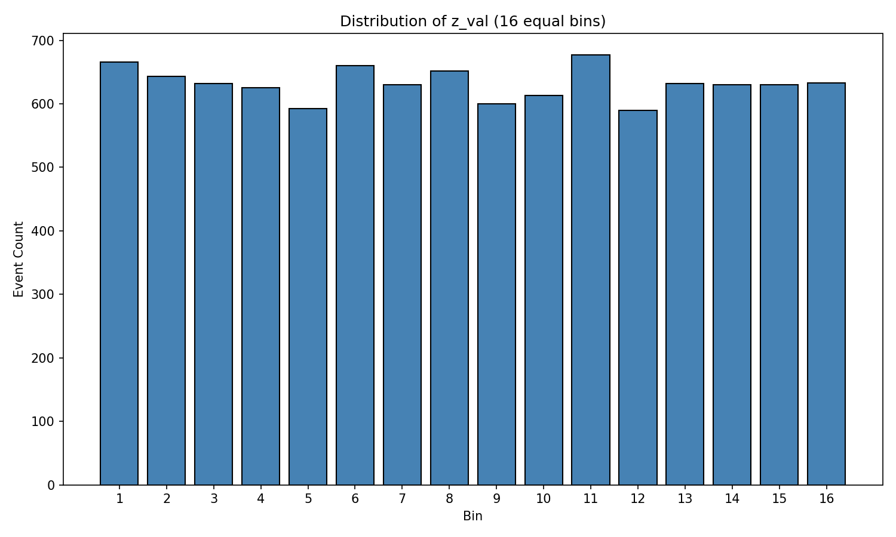
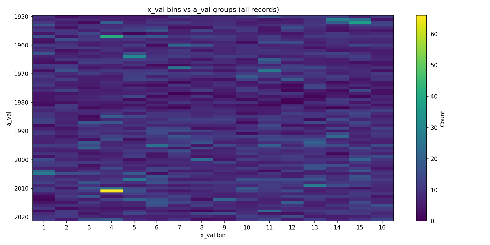
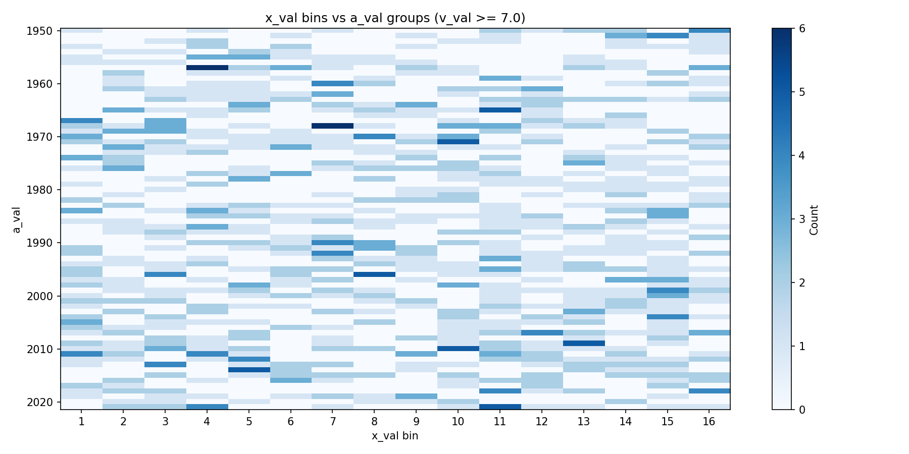
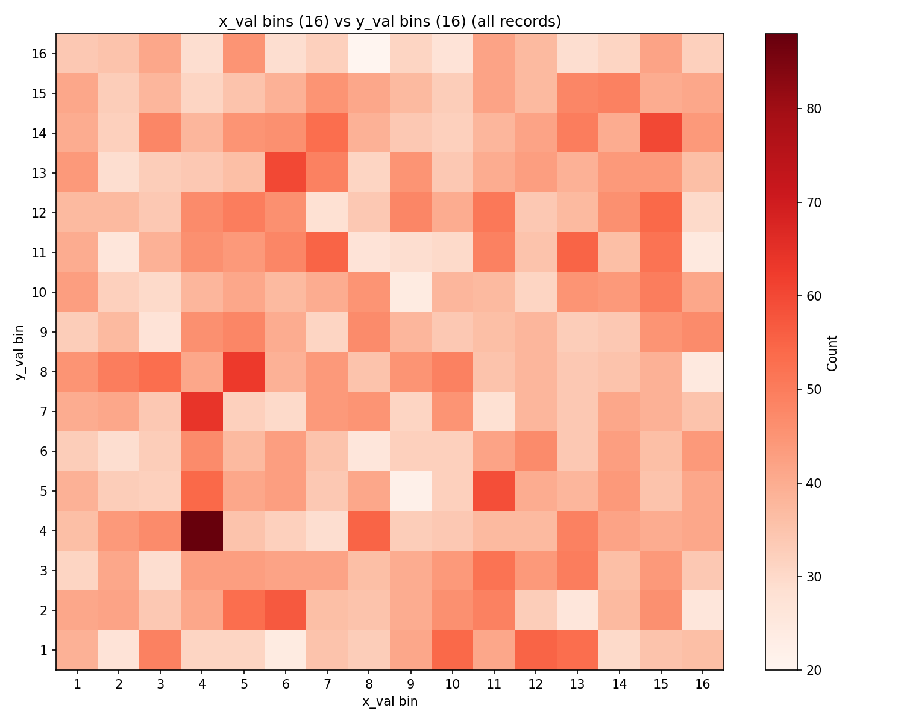
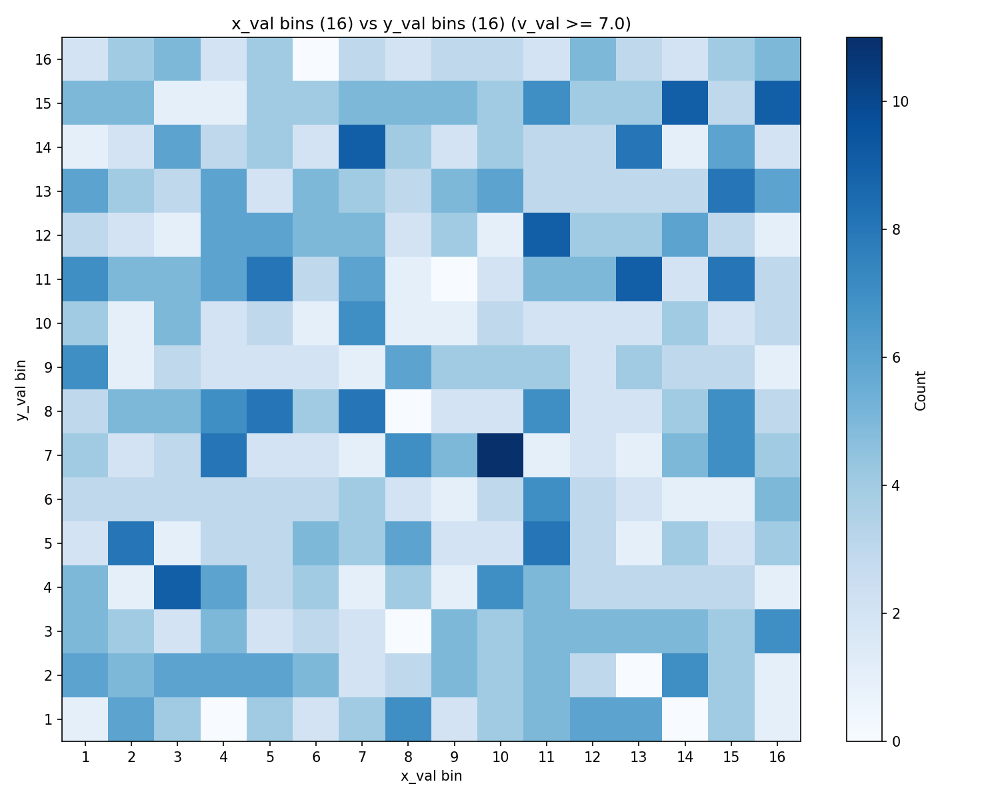
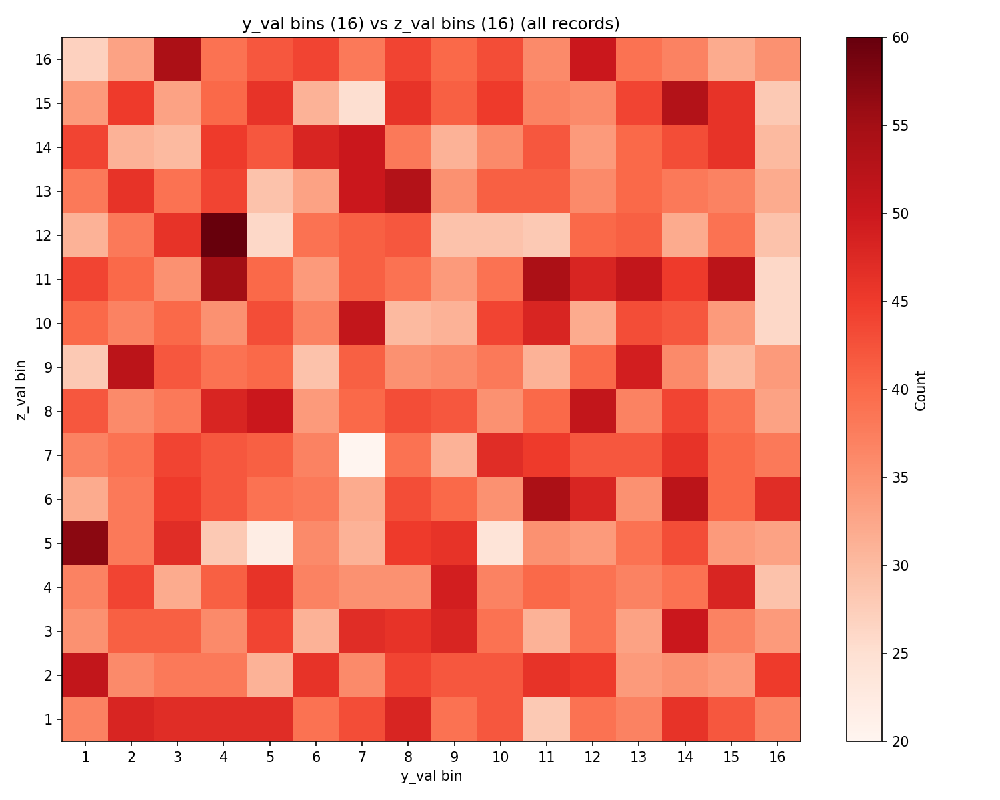
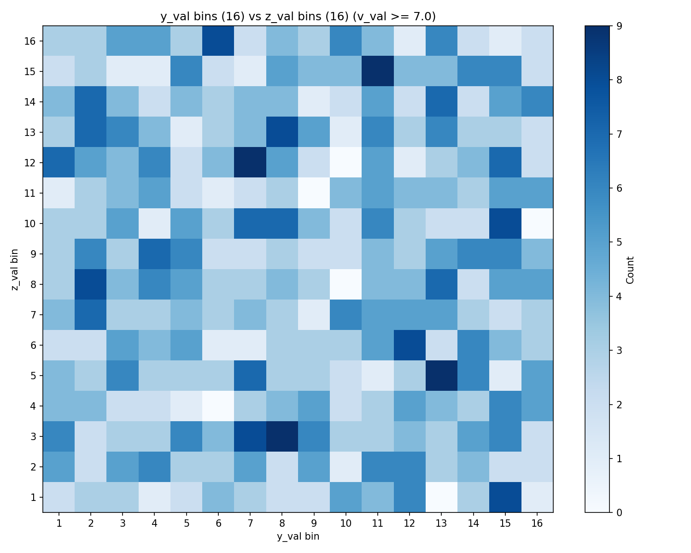

# Case 0: Population Description and Exploratory Analysis

**Document Information**
- Version: 1.0
- Date: 2026-02-12
- Approach: Blind Study (Approach Two)
- Data: Anonymized
- Purpose: Independent statistical validation

---

## 1. Population Summary

### 1.1 Dataset Overview

- **Total records:** 10,105
- **Columns:** a_val, v_val, x_val, y_val, z_val (all numeric)
- **Missing values:** None (0 missing across all columns)

### 1.2 Column Statistics

| Column | Min | Max | Mean | Median | Std Dev |
|--------|-----|-----|------|--------|---------|
| a_val | 1,950 | 2,021 | 1,986.36 | 1,988.0 | 21.14 |
| v_val | 6.0 | 9.5 | 6.37 | 6.2 | 0.41 |
| x_val | 1,034 | 31,611,167 | 15,845,704.0 | 15,778,087.0 | 9,096,939.0 |
| y_val | 248 | 2,574,090 | 1,278,781.5 | 1,272,869.0 | 737,496.6 |
| z_val | 1 | 86,386 | 43,005.96 | 42,831.0 | 25,036.9 |

### 1.3 Unique a_val Groups

There are **72 unique a_val values**, forming a consecutive integer sequence from 1950 to 2021.

Group sizes range from **82** (a_val=1977) to **212** (a_val=2011), with a mean group size of **140.3 records**. Group sizes are not perfectly uniform but are of comparable magnitude across the full range.

### 1.4 v_val Filter Subset

Records with **v_val >= 7.0**: **968 records (9.6%** of total). v_val is right-skewed with the majority of values concentrated near the lower end (Q1=6.1, median=6.2, Q3=6.5).

---

## 2. Data Quality

### 2.1 Completeness

The dataset is **100% complete** with zero missing values across all five columns. No data cleaning or imputation was required.

### 2.2 Distribution Observations

- **a_val**: Discrete integer values spanning 1950-2021 (72 values). Distribution is roughly uniform across groups, though some variation in group size exists.
- **v_val**: Narrow range (6.0-9.5) with a strongly right-skewed distribution. The bulk of values fall between 6.0 and 6.5; only ~9.6% reach 7.0 or above.
- **x_val**: Large numeric range (1,034 to ~31.6M). Mean and median are close (~15.8M), suggesting a roughly symmetric distribution.
- **y_val**: Range of 248 to ~2.57M. Mean and median are close (~1.28M), suggesting roughly symmetric distribution.
- **z_val**: Range of 1 to ~86.4K. Mean and median are close (~43K), suggesting roughly symmetric distribution.

### 2.3 Anomalies

No obvious anomalies detected. All values fall within plausible numeric ranges with no extreme outliers evident from summary statistics. The close agreement between mean and median for x_val, y_val, and z_val indicates these distributions are not heavily skewed.

---

## 3. Visualization Analysis

### 3.1 Histograms

All three histograms use 16 equal-width bins spanning [0, max] for each variable.

**x_val Distribution**

- Distribution is approximately uniform across the 16 bins, with counts ranging from roughly 570 to 720 per bin.
- Slight peaks visible at bins 4, 5, 11, and 15; slight troughs at bins 2, 9, and 16.
- Overall, the distribution does not show strong skew or multimodality.

**y_val Distribution**

- Also approximately uniform, with counts ranging from roughly 540 to 680.
- Slight peaks at bins 4, 8, 12, and 14; the lowest count is in bin 16.
- No strong pattern deviating from uniform distribution.

**z_val Distribution**

- Approximately uniform, with counts ranging from roughly 590 to 680.
- Slight peaks at bins 1, 6, 8, and 11; slight troughs at bins 5 and 12.
- No strong pattern deviating from uniform distribution.

**Summary**: All three variables (x_val, y_val, z_val) exhibit approximately uniform distributions when binned into 16 equal-width bins. Minor variation in bin counts exists but appears consistent with sampling noise.

### 3.2 Heatmaps

#### 3.2.1 x_val vs a_val

**All records**

- The heatmap shows records distributed across all a_val groups and all 16 x_val bins.
- Most cells contain low single-digit to low double-digit counts. A few isolated cells show higher concentrations (up to ~70), appearing as bright spots.
- These high-concentration cells appear scattered without an obvious systematic pattern, though some a_val groups show localized clustering in certain x_val bins.
- No dominant diagonal or banding structure is evident.

**v_val >= 7.0 filter**

- With only 968 records, cell counts are much lower (0-6 range).
- The pattern appears sparser but otherwise similar in character to the all-records heatmap.
- No dramatic shift in the spatial distribution pattern is observed from the filter; the v_val >= 7.0 subset appears to be distributed similarly across x_val bins and a_val groups as the full dataset.

#### 3.2.2 x_val vs y_val

**All records**

- The 16x16 grid shows counts ranging from approximately 20 to 90+ per cell.
- One prominent hot spot appears at approximately (x_bin=4, y_bin=4) with the highest count.
- The distribution is somewhat noisy but does not show a clear diagonal relationship between x_val and y_val.
- There is no strong evidence of linear correlation from visual inspection; the pattern is closer to uniform with localized variation.

**v_val >= 7.0 filter**

- Cell counts range from 0 to approximately 11.
- The pattern is noisier due to smaller sample size.
- No clear structural difference from the all-records pattern is evident; the filter does not reveal a hidden relationship between x_val and y_val.

#### 3.2.3 y_val vs z_val

**All records**

- Counts range from approximately 20 to 60 per cell.
- The distribution appears relatively uniform across the grid with some scattered hot spots.
- No strong diagonal, banding, or clustering pattern is evident.
- The relationship between y_val and z_val appears weak or nonexistent from visual inspection.

**v_val >= 7.0 filter**

- Cell counts range from 0 to approximately 9.
- Sparser pattern due to reduced sample size.
- No clear structural pattern emerges that differs from the all-records heatmap.
- The v_val >= 7.0 filter does not appear to reveal a hidden relationship between y_val and z_val.

### 3.3 Impact of v_val >= 7.0 Filter

Across all three heatmap pairs, the v_val >= 7.0 filter:
- Reduces the dataset from 10,105 to 968 records (9.6%).
- Produces sparser heatmaps with lower per-cell counts.
- Does **not** appear to fundamentally change the spatial distribution patterns. The filtered subset appears to be a proportional subsample of the full dataset without revealing hidden structure.
- Any apparent localized clustering in the filtered views is consistent with small-sample noise.

---

## 4. Preliminary Observations

1. **x_val, y_val, z_val** all have approximately uniform marginal distributions.
2. **v_val** is strongly right-skewed with most values near 6.0-6.5.
3. **a_val** consists of 72 consecutive integer groups with roughly equal representation.
4. **Pairwise relationships** (x vs y, y vs z, x vs a) show no obvious strong patterns in the heatmaps.
5. The **v_val >= 7.0 filter** does not visually alter distribution patterns.
6. These observations provide a baseline for subsequent statistical testing in Cases 1-4.

---

## 5. Supporting Files

- `case_0_results.json` — Structured statistics for all columns (machine-readable)

---

**Generation Details**
- Version: 1.0
- Date: 2026-02-12
- Planning prepared with: Claude.ai Web Interface (Haiku 4.5)
- Generated with: Claude Code 2.1.31 (Claude Model Opus 4.5)
- Project: Approach Two Blind Study - ISOLATED ANALYSIS
- Isolation Status: Complete separation from main project
