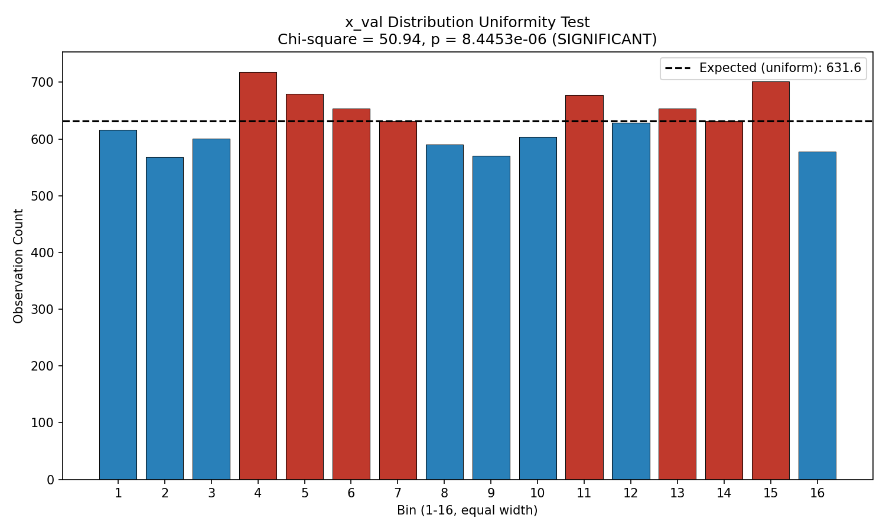
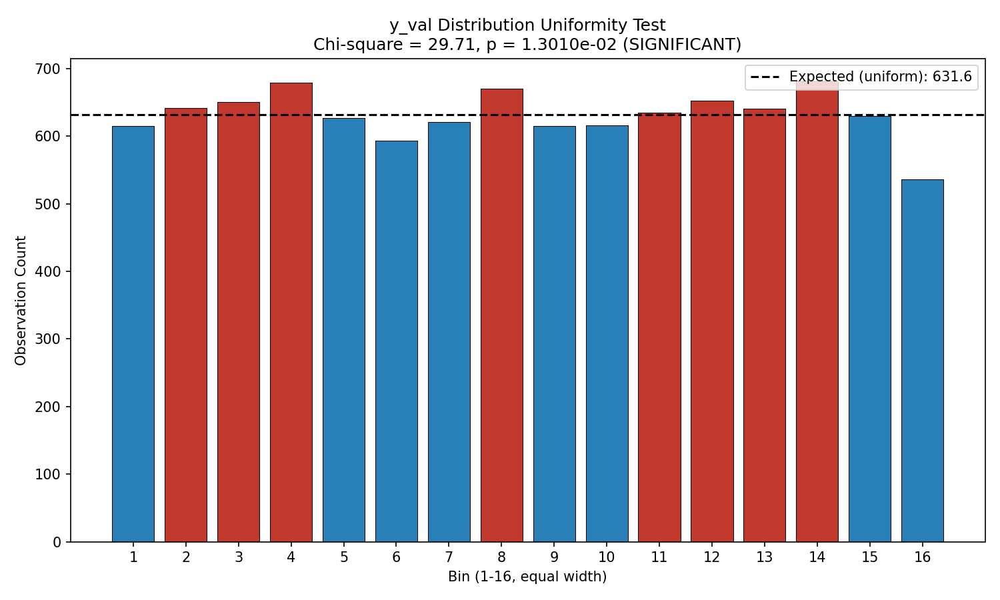
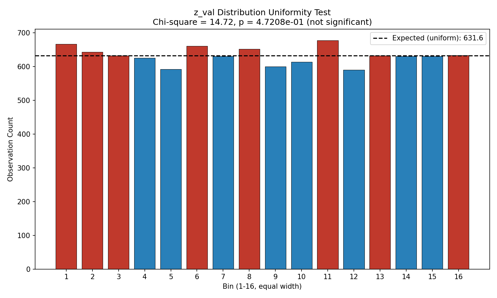
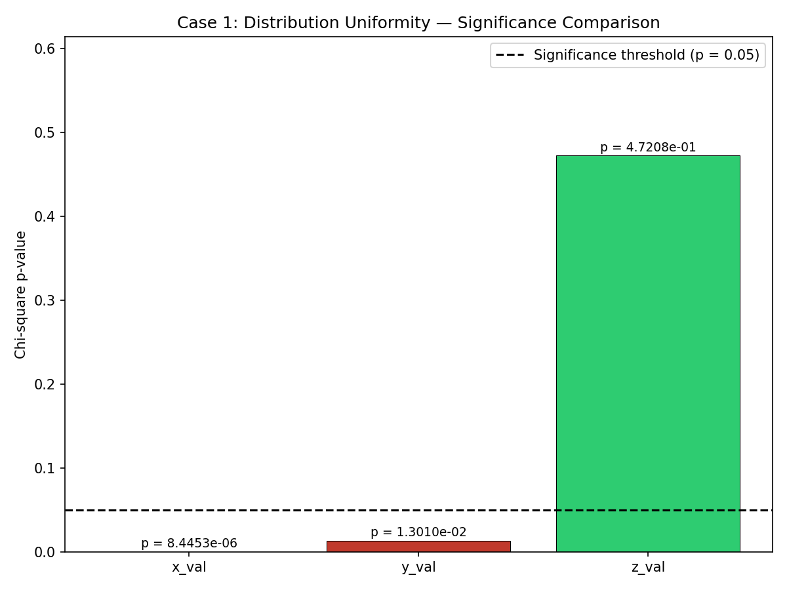

# Case 1: Distribution Uniformity Testing (Blind Study - Approach Two)

**Document Information**
- Version: 1.0
- Date: 2026-02-12
- Data: Anonymized columns (a_val, v_val, x_val, y_val, z_val)
- Project: Blind Study (Approach Two) - ISOLATED ANALYSIS
- Purpose: Test whether variables show uniform or clustering patterns

---

## 1. Population Summary (from Case 0)

| Variable | Min | Max | Mean | Median | Std Dev | N |
|----------|-----|-----|------|--------|---------|---|
| x_val | 1,034 | 31,611,167 | 15,845,704.0 | 15,778,087.0 | 9,096,939.0 | 10,105 |
| y_val | 248 | 2,574,090 | 1,278,781.5 | 1,272,869.0 | 737,496.6 | 10,105 |
| z_val | 1 | 86,386 | 43,006.0 | 42,831.0 | 25,036.9 | 10,105 |

All three variables have mean and median in close agreement, suggesting roughly symmetric marginal distributions. Case 0 histograms showed approximately uniform distributions across 16 bins with minor variation. Case 1 now formally tests whether those minor variations are statistically significant.

---

## 2. Methodology

### 2.1 Chi-Square Goodness-of-Fit Test

For each variable, the range [min, max] was divided into **16 equal-width bins**. The count of observations in each bin was compared to the expected count under a uniform distribution (N/16 = 631.56 per bin).

- **Null hypothesis (H0):** Observations are uniformly distributed across all 16 bins.
- **Alternative hypothesis (H1):** Observations are not uniformly distributed (clustering exists).
- **Test statistic:** χ² = Σ (observed - expected)² / expected
- **Degrees of freedom:** k - 1 = 15
- **Significance threshold:** p < 0.05

### 2.2 Rayleigh Test

The Rayleigh test assesses directional concentration in circular data. Each variable's range was mapped to [0, 2π] and the mean resultant length (R̄) was computed. The test statistic Z = n × R̄² follows an approximately exponential distribution under uniformity.

**Applicability note:** The Rayleigh test is designed for circular/directional data. Since we have not identified whether these variables represent angular quantities, the results are reported for completeness but should be interpreted cautiously. The Rayleigh test specifically detects unimodal directional concentration and may miss multi-modal non-uniformity that the chi-square test captures.

### 2.3 Effect Size (Cramér's V)

Cramér's V = √(χ² / (n × (k - 1))) provides a dimensionless measure of the strength of deviation from uniformity, on a 0–1 scale:
- V < 0.01: negligible
- 0.01 ≤ V < 0.03: small
- 0.03 ≤ V < 0.05: moderate
- V ≥ 0.05: large

---

## 3. Results

### 3.1 x_val Distribution

| Metric | Value |
|--------|-------|
| Chi-square (χ²) | 50.94 |
| p-value | 8.45 × 10⁻⁶ |
| Degrees of freedom | 15 |
| Interpretation | **Significant** (p < 0.05) |
| Rayleigh Z | 0.058 |
| Rayleigh p-value | 0.944 |
| Cramér's V | 0.0183 (small effect) |
| Sample size | 10,105 |
| Expected count per bin | 631.56 |

**Bin counts:** 616, 568, 601, 718, 680, 654, 632, 590, 570, 604, 678, 629, 654, 632, 701, 578

**Interpretation:** x_val shows a **statistically significant non-uniform distribution** (χ² = 50.94, p = 8.45 × 10⁻⁶). However, the effect size is small (V = 0.018). The Rayleigh test is not significant (p = 0.944), indicating no single-direction concentration when data is mapped to circular coordinates.

- **Bins above expected (>631.56):** 4 (718), 5 (680), 6 (654), 7 (632), 11 (678), 13 (654), 14 (632), 15 (701)
- **Bins below expected (<631.56):** 1 (616), 2 (568), 3 (601), 8 (590), 9 (570), 10 (604), 12 (629), 16 (578)

The strongest clustering appears in bins 4 (718) and 15 (701), while the sparsest bins are 2 (568) and 9 (570). This suggests mild multi-modal variation rather than a single concentration point.

### 3.2 y_val Distribution

| Metric | Value |
|--------|-------|
| Chi-square (χ²) | 29.71 |
| p-value | 1.30 × 10⁻² |
| Degrees of freedom | 15 |
| Interpretation | **Significant** (p < 0.05) |
| Rayleigh Z | 0.162 |
| Rayleigh p-value | 0.851 |
| Cramér's V | 0.0140 (small effect) |
| Sample size | 10,105 |
| Expected count per bin | 631.56 |

**Bin counts:** 615, 642, 651, 679, 627, 593, 621, 670, 615, 616, 635, 653, 641, 681, 630, 536

**Interpretation:** y_val shows a **statistically significant non-uniform distribution** (χ² = 29.71, p = 0.013). The effect size is small (V = 0.014). The Rayleigh test is not significant (p = 0.851).

- **Bins above expected (>631.56):** 2 (642), 3 (651), 4 (679), 8 (670), 11 (635), 12 (653), 13 (641), 14 (681)
- **Bins below expected (<631.56):** 1 (615), 5 (627), 6 (593), 7 (621), 9 (615), 10 (616), 15 (630), 16 (536)

The most notable feature is the deficit in bin 16 (536, the lowest count across all bins and variables). Bin 14 (681) shows the highest concentration. The deviation from uniformity is weaker than x_val.

### 3.3 z_val Distribution

| Metric | Value |
|--------|-------|
| Chi-square (χ²) | 14.72 |
| p-value | 0.472 |
| Degrees of freedom | 15 |
| Interpretation | **Not significant** (p > 0.05) |
| Rayleigh Z | 0.220 |
| Rayleigh p-value | 0.803 |
| Cramér's V | 0.0099 (negligible effect) |
| Sample size | 10,105 |
| Expected count per bin | 631.56 |

**Bin counts:** 666, 643, 632, 625, 592, 660, 630, 652, 600, 613, 677, 590, 632, 630, 630, 633

**Interpretation:** z_val shows **no significant deviation from uniform distribution** (χ² = 14.72, p = 0.472). The effect size is negligible (V = 0.010). The Rayleigh test is also not significant (p = 0.803).

- **Bins above expected (>631.56):** 1 (666), 2 (643), 3 (632), 6 (660), 8 (652), 11 (677), 13 (632), 16 (633)
- **Bins below expected (<631.56):** 4 (625), 5 (592), 7 (630), 9 (600), 10 (613), 12 (590), 14 (630), 15 (630)

Bin counts range from 590 to 677, the narrowest spread of any variable. The variation is fully consistent with sampling noise.

---

## 4. Comparative Analysis

### 4.1 Summary Table

| Variable | χ² | p-value | Significant? | Cramér's V | Rank |
|----------|-----|---------|-------------|------------|------|
| x_val | 50.94 | 8.45 × 10⁻⁶ | Yes | 0.0183 | 1 (strongest) |
| y_val | 29.71 | 1.30 × 10⁻² | Yes | 0.0140 | 2 |
| z_val | 14.72 | 4.72 × 10⁻¹ | No | 0.0099 | 3 (weakest) |

### 4.2 Findings

1. **x_val and y_val** both show statistically significant deviation from uniform distribution (p < 0.05). x_val has the stronger signal (p = 8.45 × 10⁻⁶) compared to y_val (p = 0.013).

2. **z_val** appears uniformly distributed (p = 0.472). There is no evidence of clustering.

3. **Effect sizes are universally small.** Even the strongest deviation (x_val, V = 0.018) represents a small effect. The non-uniformity in x_val and y_val is real but subtle — bin counts deviate from the expected 631.56 by at most ~14% (x_val bin 4: 718 vs expected 631.56).

4. **Rayleigh tests are not significant for any variable** (all p > 0.80). This indicates no single-direction angular concentration when data is mapped to circular coordinates. The non-uniformity detected by chi-square in x_val and y_val is multi-modal (multiple peaks/troughs) rather than unimodal.

5. **Ranking by effect size:** x_val (V = 0.0183) > y_val (V = 0.0140) > z_val (V = 0.0099).

---

## 5. Limitations

1. **Variable identity unknown.** We have not identified what x_val, y_val, or z_val represent. The meaning of clustering patterns cannot be interpreted.

2. **Circular test applicability uncertain.** The Rayleigh test assumes circular/angular data. Without knowing the nature of these variables, its applicability is uncertain. Results are reported for completeness.

3. **Small effect sizes despite significance.** With n = 10,105, the chi-square test has substantial statistical power to detect even minor deviations from uniformity. The significant results for x_val and y_val reflect real but small departures from uniform distribution. Practical significance should not be equated with statistical significance.

4. **Bin count sensitivity.** The choice of 16 bins is a convention. Different bin counts could yield different p-values. The results reflect the specific binning scheme used.

5. **Next steps.** Subsequent cases will test for specific types of patterns (e.g., temporal clustering, correlation structure) to characterize the nature of any non-uniformity detected here.

---

## 6. Supporting Files

- `case_1_results_blind.json` — Full structured results (machine-readable)
- `case_1_histogram_x_val_blind.png` — x_val bin distribution with uniform baseline
- `case_1_histogram_y_val_blind.png` — y_val bin distribution with uniform baseline
- `case_1_histogram_z_val_blind.png` — z_val bin distribution with uniform baseline
- `case_1_significance_comparison_blind.png` — Cross-variable p-value comparison
- `src/case_1_blind_analysis.py` — Analysis code
- `src/visualization_case_1_blind.py` — Visualization code
- `tests/test_case_1_blind.py` — Test suite (19 tests, all passing)

---

**Generation Details**
- Version: 1.0
- Date: 2026-02-12
- Planning prepared with: Claude.ai Web Interface (Haiku 4.5)
- Generated with: Claude Code 2.1.31 (Claude Model Opus 4.6)
- Project: Approach Two Blind Study - ISOLATED ANALYSIS
- Isolation Status: Complete separation from main project
