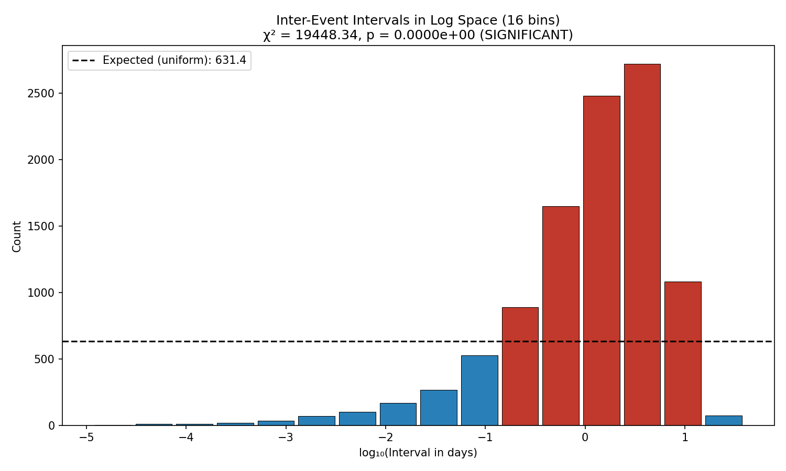
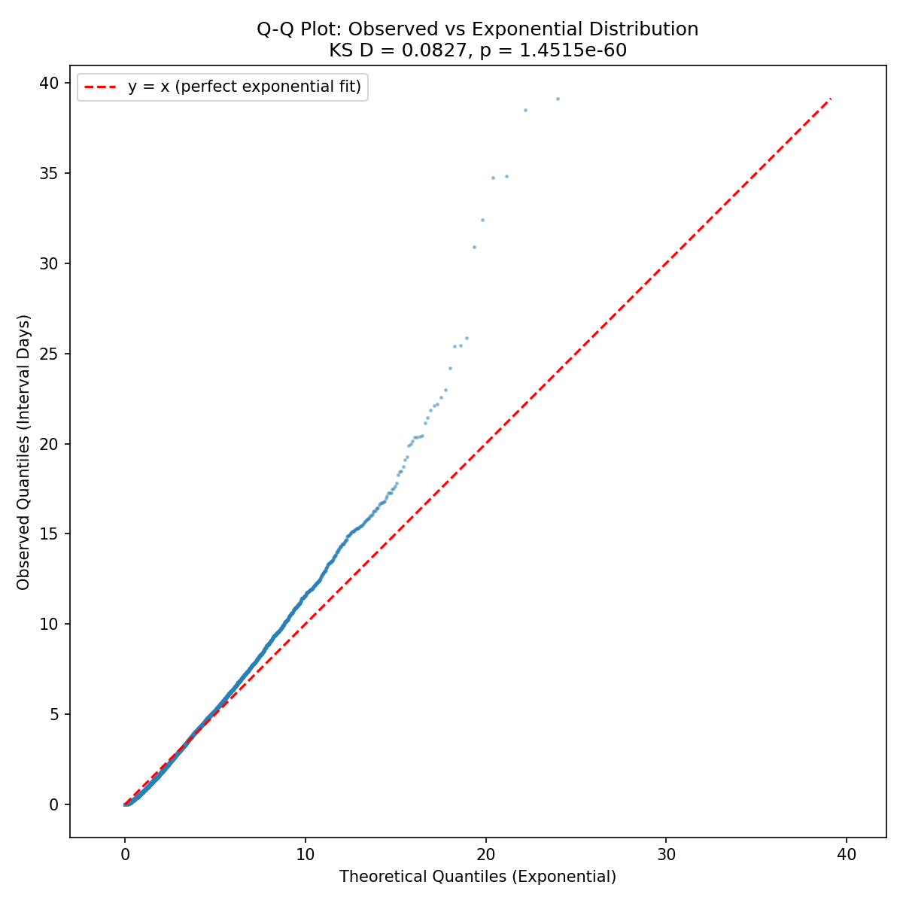
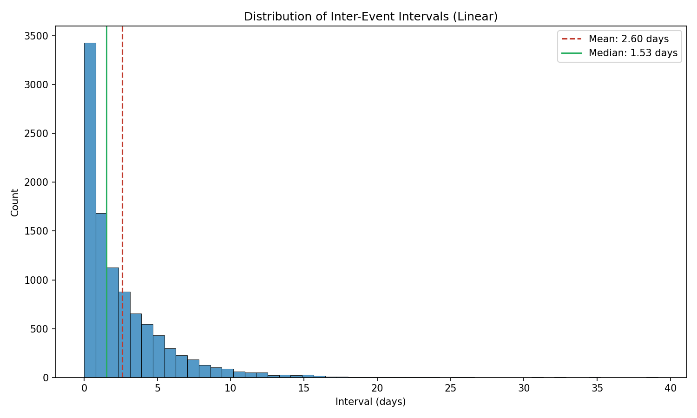
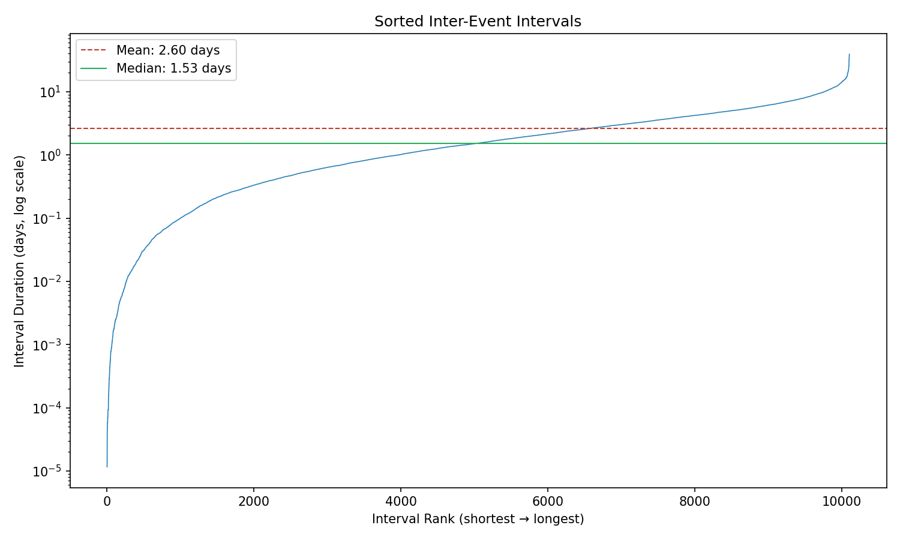

# Case 2A: Inter-Event Interval Analysis (Blind Study - Approach Two)

**Document Information**
- Version: 1.0
- Date: 2026-02-12
- Approach: Blind Study (Approach Two)
- Data: Anonymized timestamp intervals (calculated from timestamps)
- Project: Blind Study (Approach Two) - ISOLATED ANALYSIS
- Purpose: Detect clustering in temporal spacing of events

---

## 1. Data Processing

### 1.1 Preprocessing Steps

1. Loaded `data/timestamp_vals.csv` containing `v_val` (numeric) and `timestamp` (ISO8601 format) columns
2. Parsed all timestamps as UTC datetime objects
3. Sorted records chronologically by timestamp
4. Calculated inter-event intervals: delta_t[i] = timestamp[i+1] - timestamp[i]
5. Converted intervals to fractional days (seconds / 86,400)
6. Removed any zero or negative intervals (invalid)

### 1.2 Processing Summary

| Metric | Value |
|--------|-------|
| Total records loaded | 10,105 |
| Valid intervals calculated | 10,103 |
| Records with zero/negative intervals removed | 2 |
| Date range start | 1949-12-25 |
| Date range end | 2021-12-20 |
| Total time span | ~72 years |
| Timestamp parsing status | Success |

Two intervals were removed (likely duplicate timestamps producing zero-second gaps). The remaining 10,103 intervals form the analysis sample.

---

## 2. Sample Description

| Statistic | Value |
|-----------|-------|
| Number of intervals (N) | 10,103 |
| Time span of dataset | ~72 years (1949–2021) |
| Minimum interval | 0.000012 days (~1.04 seconds) |
| Maximum interval | 39.136 days |
| Mean interval | 2.602 days |
| Median interval | 1.534 days |
| Standard deviation | 3.105 days |
| Q1 (25th percentile) | 0.478 days (~11.5 hours) |
| Q3 (75th percentile) | 3.659 days |
| IQR | 3.180 days |
| Max/min ratio | 3,381,377 |

The mean (2.60 days) exceeds the median (1.53 days), indicating a right-skewed distribution where most intervals are relatively short but a tail of longer gaps pulls the mean upward. The enormous max/min ratio (>3.3 million) reflects the extreme range from ~1-second gaps to ~39-day gaps.

---

## 3. Methodology

### 3.1 Interval Calculation

Inter-event intervals were computed as the time difference between consecutive events after chronological sorting. Each interval delta_t[i] = timestamp[i+1] - timestamp[i] was converted to fractional days.

### 3.2 Chi-Square Uniformity Test (Log-Binned)

Because interval durations span several orders of magnitude (from seconds to weeks), we binned intervals in **log10 space** rather than linear space. This ensures that very short and very long intervals are compared fairly.

- The range [log10(min_interval), log10(max_interval)] was divided into **16 equal-width bins**
- The count of intervals in each bin was compared to the expected uniform count (N/16 = 631.44)
- **Null hypothesis (H0):** Intervals are uniformly distributed in log space (no preferred timescale)
- **Alternative (H1):** Intervals cluster at certain timescales
- **Why 16 bins:** Consistent with Case 1 binning convention; provides sufficient resolution across the log range

### 3.3 Exponential Distribution Baseline (KS Test)

If events occur as a random Poisson process, the inter-event intervals follow an exponential distribution with rate lambda = 1/mean. The Kolmogorov-Smirnov (KS) test measures the maximum deviation between the observed cumulative distribution and the theoretical exponential CDF.

- **H0:** Intervals follow an exponential distribution (random Poisson process)
- **H1:** Intervals deviate from exponential (non-random temporal structure)
- lambda = 1 / mean_interval = 0.384 events/day

### 3.4 Coefficient of Variation (CV)

CV = std_dev / mean measures the relative dispersion of intervals.

- For a perfect exponential (random) process: CV = 1.0
- CV > 1.5: Clustering — some very short intervals mixed with very long gaps
- CV < 0.7: Regularity — intervals are more uniform than a random process
- 0.7 <= CV <= 1.5: Consistent with random or intermediate behavior

### 3.5 Effect Size (Cramer's V)

Cramer's V = sqrt(chi2 / (N * (k - 1))) provides a dimensionless measure of deviation from uniformity on a 0-1 scale:
- V < 0.10: small
- 0.10 <= V < 0.30: medium
- V >= 0.30: large

---

## 4. Results

### 4.1 Uniformity Test Results (Chi-Square on Log-Binned Intervals)

| Metric | Value |
|--------|-------|
| Chi-square (chi2) | 19,448.34 |
| p-value | < 2.2e-308 (effectively 0) |
| Degrees of freedom | 15 |
| Interpretation | **Significant** (p < 0.05) |
| Cramer's V | 0.358 (large effect) |
| Expected count per bin | 631.44 |

**Bin counts (16 bins in log10 space):**

| Bin | Log10 Range (approx) | Days Range (approx) | Count | vs Expected |
|-----|---------------------|---------------------|-------|-------------|
| 1 | -4.92 to -4.51 | 0.00001 – 0.00003 | 2 | deficit |
| 2 | -4.51 to -4.11 | 0.00003 – 0.00008 | 9 | deficit |
| 3 | -4.11 to -3.70 | 0.00008 – 0.0002 | 12 | deficit |
| 4 | -3.70 to -3.29 | 0.0002 – 0.0005 | 17 | deficit |
| 5 | -3.29 to -2.89 | 0.0005 – 0.001 | 34 | deficit |
| 6 | -2.89 to -2.48 | 0.001 – 0.003 | 68 | deficit |
| 7 | -2.48 to -2.07 | 0.003 – 0.009 | 99 | deficit |
| 8 | -2.07 to -1.67 | 0.009 – 0.02 | 168 | deficit |
| 9 | -1.67 to -1.26 | 0.02 – 0.06 | 267 | deficit |
| 10 | -1.26 to -0.85 | 0.06 – 0.14 | 527 | deficit |
| 11 | -0.85 to -0.44 | 0.14 – 0.36 | 888 | **excess** |
| 12 | -0.44 to -0.04 | 0.36 – 0.91 | 1,650 | **excess** |
| 13 | -0.04 to 0.37 | 0.91 – 2.3 | 2,482 | **excess** |
| 14 | 0.37 to 0.78 | 2.3 – 6.0 | 2,723 | **excess** |
| 15 | 0.78 to 1.18 | 6.0 – 15.1 | 1,084 | **excess** |
| 16 | 1.18 to 1.59 | 15.1 – 39.1 | 73 | deficit |

**Interpretation:** The intervals show an **extremely strong non-uniform distribution** in log space (chi2 = 19,448, p effectively 0, V = 0.358). Intervals are overwhelmingly concentrated in bins 11–15, corresponding to durations of ~0.14 to ~15 days. Bins 13 and 14 alone (0.91–6.0 days) contain 5,205 of the 10,103 intervals (51.5%).

The lowest 10 bins (intervals < ~0.14 days / ~3.4 hours) collectively contain only 1,203 intervals (11.9%), and the very short intervals (< 1 minute) are extremely rare. The longest bin (15–39 days) contains only 73 intervals, indicating that extended gaps between events are uncommon.

### 4.2 Exponential Baseline Test

| Metric | Value |
|--------|-------|
| KS statistic (D) | 0.0827 |
| p-value | 1.45 x 10^-60 |
| Lambda (rate parameter) | 0.384 events/day |
| Interpretation | **Deviates from random** |

**Interpretation:** The intervals **significantly deviate from an exponential distribution** (D = 0.083, p = 1.45 x 10^-60). The events are not generated by a simple random Poisson process. The Q-Q plot shows systematic departure from the diagonal reference line, confirming that the observed interval distribution has a different shape than the exponential.

### 4.3 Coefficient of Variation

| Metric | Value |
|--------|-------|
| CV | 1.193 |
| Interpretation | Random (0.7 <= CV <= 1.5) |
| Q1 | 0.478 days |
| Q3 | 3.659 days |
| IQR | 3.180 days |

**Interpretation:** The CV of 1.193 falls within the range typically associated with a random process (0.7–1.5), though it is somewhat above 1.0. This is an intermediate result — the variability of intervals is slightly higher than a pure exponential process would predict, but not extreme enough to qualify as strong clustering (which would require CV > 1.5).

### 4.4 Clustering Indicators

| Indicator | Value |
|-----------|-------|
| Intervals shorter than median | 5,051 (50.0%) |
| Intervals longer than 3x mean (>7.81 days) | 648 (6.4%) |
| Max-to-min interval ratio | 3,381,377 |

About half (50.0%) of intervals are shorter than the median, as expected. The 6.4% of intervals exceeding three times the mean indicates a moderate tail of long gaps. The enormous max/min ratio reflects the full range from near-instantaneous to month-long gaps, though this is driven by a small number of extreme values.

---

## 5. Comparative Summary

### 5.1 Agreement Across Tests

| Test | Result | Strength |
|------|--------|----------|
| Chi-square (log-binned) | Significant (p ≈ 0) | Very strong (V = 0.358) |
| KS exponential test | Significant (p = 1.45 x 10^-60) | Very strong (D = 0.083) |
| Coefficient of variation | Random range (CV = 1.19) | Intermediate |

### 5.2 Synthesis

1. **Strong non-uniformity in log space.** The chi-square test reveals massive clustering of intervals at specific timescales. Most intervals (88%) fall between 0.14 and 39 days, with a peak concentration at 1–6 days. Very short intervals (seconds to hours) and very long intervals (>15 days) are rare. This is a large effect (V = 0.358), far exceeding the small effects seen in Case 1.

2. **Not a random Poisson process.** The KS test conclusively rejects the exponential baseline. Events are not randomly timed — there is temporal structure in the data.

3. **CV tells a nuanced story.** While the chi-square and KS tests both show strong deviation from randomness, the CV (1.19) falls within the "random" range. This suggests that while the intervals are concentrated at certain timescales (not log-uniform), their overall variability is not extreme enough to indicate severe clustering/bursting behavior. The process has structure but is not dominated by alternating bursts and quiescent periods.

4. **The chi-square test provides the strongest evidence.** With V = 0.358, the log-space non-uniformity is by far the most informative result, revealing a clear preferred timescale of ~1–6 days between events.

---

## 6. Limitations

1. **Event identity unknown.** We have not identified what the events represent or what physical process generates them. The meaning of the ~1–6 day preferred interval cannot be interpreted.

2. **Timestamp precision unknown.** The shortest observed interval (~1 second) may reflect measurement precision rather than true event proximity.

3. **Non-stationarity not tested.** The 72-year time span may encompass changes in event rate over time. A constant-rate assumption underlies the exponential baseline test. Future cases could address temporal non-stationarity.

4. **v_val not used.** The `v_val` column was not incorporated into this analysis. Its relationship to interval timing is unexplored.

5. **Bin count sensitivity.** The 16-bin choice is conventional. Different bin counts in log space could yield different chi-square statistics, though the overwhelming non-uniformity would persist.

---

## 7. Supporting Files

- `case_2_results_blind.json` — Full structured results (machine-readable)
- `case_2_histogram_linear_blind.png` — Linear-scale interval distribution with mean/median
- `case_2_histogram_log_blind.png` — Log-space bin distribution with uniform baseline
- `case_2_qq_plot_exponential_blind.png` — Q-Q plot against exponential distribution
- `case_2_sorted_intervals_blind.png` — Sorted interval rank plot (log scale)
- `src/case_2_blind_analysis.py` — Analysis code
- `src/visualization_case_2_blind.py` — Visualization code
- `tests/test_case_2_blind.py` — Test suite (37 tests, all passing)

---

**Generation Details**
- Version: 1.0
- Date: 2026-02-12
- Planning prepared with: Claude.ai Web Interface (Haiku 4.5)
- Generated with: Claude Code 2.1.31 (Claude Model Opus 4.6)
- Project: Approach Two Blind Study - ISOLATED ANALYSIS
- Isolation Status: Complete separation from main project
