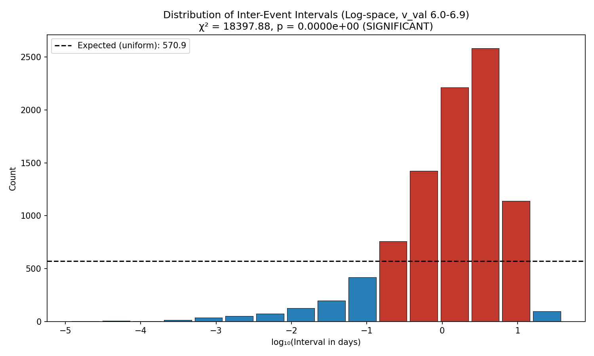
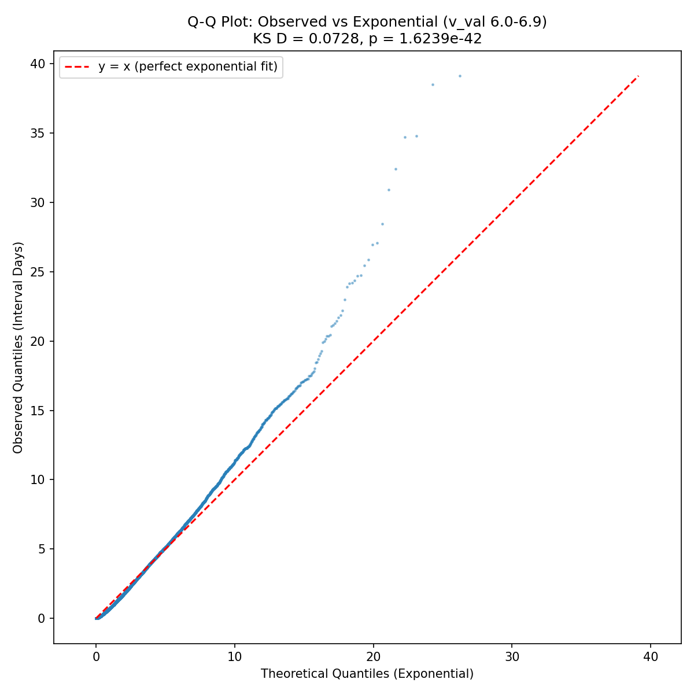
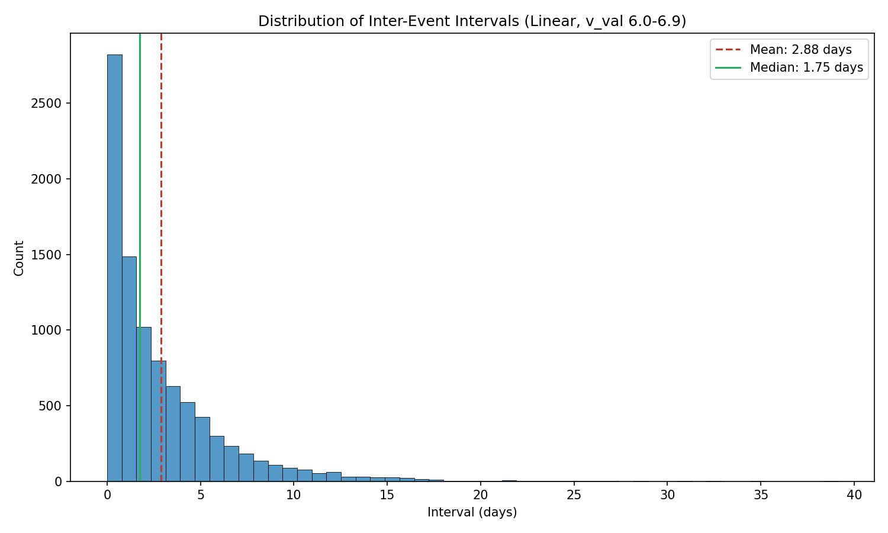
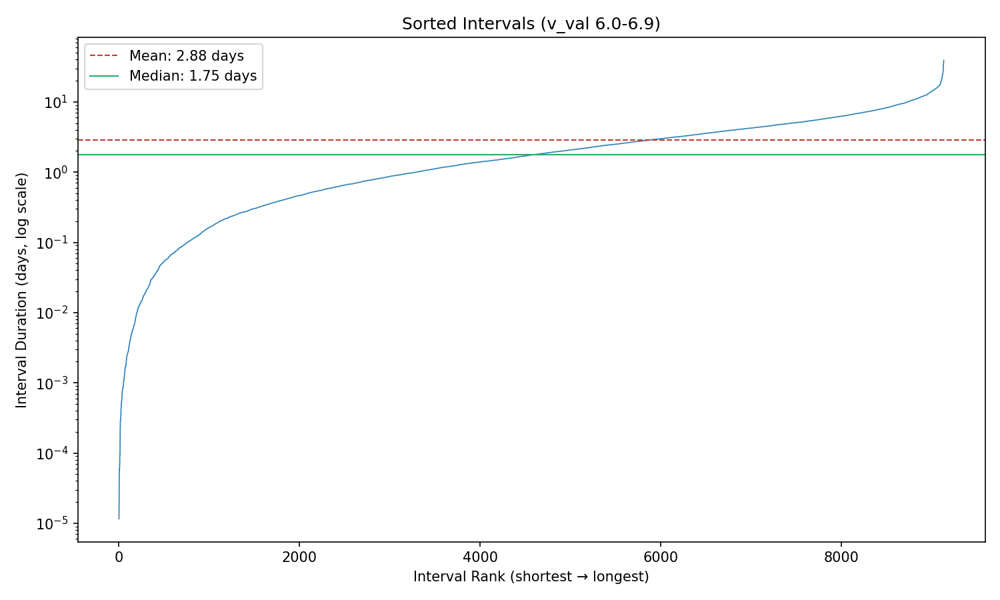

# Case 2B: Inter-Event Interval Analysis - Filtered Population (Blind Study - Approach Two)

**Document Information**
- Version: 1.0
- Date: 2026-02-13
- Data: Anonymized timestamp intervals (v_val 6.0-6.9 filtered)
- Project: Blind Study (Approach Two) - ISOLATED ANALYSIS
- Purpose: Detect clustering in temporal spacing on filtered population

---

## 1. Data Processing

### 1.1 Preprocessing Steps

1. Loaded `data/timestamp_vals.csv` containing `v_val` (numeric) and `timestamp` (ISO8601 format) columns
2. Parsed all timestamps as UTC datetime objects
3. **Applied v_val filter:** retained only records where 6.0 <= v_val <= 6.9
4. Sorted filtered records chronologically by timestamp
5. Calculated inter-event intervals: delta_t[i] = timestamp[i+1] - timestamp[i]
6. Converted intervals to fractional days (seconds / 86,400)
7. Removed any zero or negative intervals (invalid)

### 1.2 Processing Summary

| Metric | Value |
|--------|-------|
| Total records loaded | 10,105 |
| v_val filter applied | 6.0 <= v_val <= 6.9 |
| Records after filter | 9,136 (90.4% of total) |
| Valid intervals calculated | 9,134 |
| Records with zero/negative intervals removed | 2 |
| Date range start | 1949-12-25 |
| Date range end | 2021-12-20 |
| Total time span | ~72 years |
| Timestamp parsing status | Success |

The v_val 6.0-6.9 filter retains a large majority of the data (90.4%). Two intervals were removed (likely duplicate timestamps producing zero-second gaps). The remaining 9,134 intervals form the analysis sample.

---

## 2. Sample Description

| Statistic | Case 2B (Filtered) | Case 2 (Complete) |
|-----------|-------------------|-------------------|
| Number of intervals (N) | 9,134 | 10,103 |
| Time span of dataset | ~72 years (1949-2021) | ~72 years (1949-2021) |
| Minimum interval | 0.000012 days (~1.04 seconds) | 0.000012 days (~1.04 seconds) |
| Maximum interval | 39.136 days | 39.136 days |
| Mean interval | 2.879 days | 2.602 days |
| Median interval | 1.754 days | 1.534 days |
| Standard deviation | 3.368 days | 3.105 days |
| Q1 (25th percentile) | 0.572 days (~13.7 hours) | 0.478 days (~11.5 hours) |
| Q3 (75th percentile) | 4.042 days | 3.659 days |
| IQR | 3.470 days | 3.180 days |
| Max/min ratio | 3,381,377 | 3,381,377 |

The filtered population shows slightly higher central tendency than the complete population: the mean is 10.6% higher (2.879 vs 2.602 days) and the median is 14.3% higher (1.754 vs 1.534 days). This suggests that records excluded by the filter (v_val outside 6.0-6.9) tend to have somewhat shorter intervals between them. The min and max intervals are identical, indicating the extreme values occur within the v_val 6.0-6.9 subpopulation.

---

## 3. Methodology

### 3.1 Interval Calculation

Inter-event intervals were computed as the time difference between consecutive events after chronological sorting of the **filtered** population. Each interval delta_t[i] = timestamp[i+1] - timestamp[i] was converted to fractional days. Because only v_val 6.0-6.9 records are included, the intervals represent gaps between consecutive events within this subpopulation (not gaps between consecutive events in the full dataset).

### 3.2 v_val Filtering

Records were filtered to retain only those with 6.0 <= v_val <= 6.9. This tests whether the clustering patterns detected in Case 2 (complete population) are dependent on the v_val variable or persist across subpopulations. The filter retains 90.4% of the data, so this is a majority subpopulation.

### 3.3 Chi-Square Uniformity Test (Log-Binned)

Because interval durations span several orders of magnitude (from seconds to weeks), we binned intervals in **log10 space** rather than linear space. This ensures that very short and very long intervals are compared fairly.

- The range [log10(min_interval), log10(max_interval)] was divided into **16 equal-width bins**
- The count of intervals in each bin was compared to the expected uniform count (N/16 = 570.88)
- **Null hypothesis (H0):** Intervals are uniformly distributed in log space (no preferred timescale)
- **Alternative (H1):** Intervals cluster at certain timescales
- **Why 16 bins:** Consistent with Case 1 and Case 2 binning convention; provides sufficient resolution across the log range

### 3.4 Exponential Distribution Baseline (KS Test)

If events occur as a random Poisson process, the inter-event intervals follow an exponential distribution with rate lambda = 1/mean. The Kolmogorov-Smirnov (KS) test measures the maximum deviation between the observed cumulative distribution and the theoretical exponential CDF.

- **H0:** Intervals follow an exponential distribution (random Poisson process)
- **H1:** Intervals deviate from exponential (non-random temporal structure)
- lambda = 1 / mean_interval = 0.347 events/day

### 3.5 Coefficient of Variation (CV)

CV = std_dev / mean measures the relative dispersion of intervals.

- For a perfect exponential (random) process: CV = 1.0
- CV > 1.5: Clustering — some very short intervals mixed with very long gaps
- CV < 0.7: Regularity — intervals are more uniform than a random process
- 0.7 <= CV <= 1.5: Consistent with random or intermediate behavior

### 3.6 Effect Size (Cramer's V)

Cramer's V = sqrt(chi2 / (N * (k - 1))) provides a dimensionless measure of deviation from uniformity on a 0-1 scale:
- V < 0.10: small
- 0.10 <= V < 0.30: medium
- V >= 0.30: large

---

## 4. Results

### 4.1 Uniformity Test Results (Chi-Square on Log-Binned Intervals)

| Metric | Value |
|--------|-------|
| Chi-square (chi2) | 18,397.88 |
| p-value | < 2.2e-308 (effectively 0) |
| Degrees of freedom | 15 |
| Interpretation | **Significant** (p < 0.05) |
| Cramer's V | 0.366 (large effect) |
| Expected count per bin | 570.88 |

**Bin counts (16 bins in log10 space):**

| Bin | Log10 Range (approx) | Days Range (approx) | Count | vs Expected |
|-----|---------------------|---------------------|-------|-------------|
| 1 | -4.92 to -4.51 | 0.00001 - 0.00003 | 2 | deficit |
| 2 | -4.51 to -4.11 | 0.00003 - 0.00008 | 7 | deficit |
| 3 | -4.11 to -3.70 | 0.00008 - 0.0002 | 4 | deficit |
| 4 | -3.70 to -3.29 | 0.0002 - 0.0005 | 13 | deficit |
| 5 | -3.29 to -2.89 | 0.0005 - 0.001 | 34 | deficit |
| 6 | -2.89 to -2.48 | 0.001 - 0.003 | 50 | deficit |
| 7 | -2.48 to -2.07 | 0.003 - 0.009 | 73 | deficit |
| 8 | -2.07 to -1.66 | 0.009 - 0.02 | 125 | deficit |
| 9 | -1.66 to -1.26 | 0.02 - 0.06 | 195 | deficit |
| 10 | -1.26 to -0.85 | 0.06 - 0.14 | 418 | deficit |
| 11 | -0.85 to -0.44 | 0.14 - 0.36 | 756 | **excess** |
| 12 | -0.44 to -0.04 | 0.36 - 0.92 | 1,424 | **excess** |
| 13 | -0.04 to 0.37 | 0.92 - 2.35 | 2,213 | **excess** |
| 14 | 0.37 to 0.78 | 2.35 - 6.0 | 2,583 | **excess** |
| 15 | 0.78 to 1.19 | 6.0 - 15.3 | 1,141 | **excess** |
| 16 | 1.19 to 1.59 | 15.3 - 39.1 | 96 | deficit |

**Interpretation:** The filtered intervals show an **extremely strong non-uniform distribution** in log space (chi2 = 18,398, p effectively 0, V = 0.366). Intervals are overwhelmingly concentrated in bins 11-15, corresponding to durations of ~0.14 to ~15 days. Bins 13 and 14 alone (0.92-6.0 days) contain 4,796 of the 9,134 intervals (52.5%).

The lowest 10 bins (intervals < ~0.14 days / ~3.4 hours) collectively contain only 921 intervals (10.1%), and the very short intervals (< 1 minute) are extremely rare. The longest bin (15-39 days) contains only 96 intervals, indicating that extended gaps between events are uncommon.

### 4.2 Exponential Baseline Test

| Metric | Value |
|--------|-------|
| KS statistic (D) | 0.0728 |
| p-value | 1.62 x 10^-42 |
| Lambda (rate parameter) | 0.347 events/day |
| Interpretation | **Deviates from random** |

**Interpretation:** The filtered intervals **significantly deviate from an exponential distribution** (D = 0.073, p = 1.62 x 10^-42). The events in the v_val 6.0-6.9 subpopulation are not generated by a simple random Poisson process. The Q-Q plot shows systematic departure from the diagonal reference line, confirming that the observed interval distribution has a different shape than the exponential.

### 4.3 Coefficient of Variation

| Metric | Value |
|--------|-------|
| CV | 1.170 |
| Interpretation | Random (0.7 <= CV <= 1.5) |
| Q1 | 0.572 days |
| Q3 | 4.042 days |
| IQR | 3.470 days |

**Interpretation:** The CV of 1.170 falls within the range typically associated with a random process (0.7-1.5), though it is somewhat above 1.0. This is an intermediate result — the variability of intervals is slightly higher than a pure exponential process would predict, but not extreme enough to qualify as strong clustering (which would require CV > 1.5).

### 4.4 Clustering Indicators

| Indicator | Value |
|-----------|-------|
| Intervals shorter than median | 4,567 (50.0%) |
| Intervals longer than 3x mean (>8.64 days) | 579 (6.3%) |
| Max-to-min interval ratio | 3,381,377 |

About half (50.0%) of intervals are shorter than the median, as expected. The 6.3% of intervals exceeding three times the mean indicates a moderate tail of long gaps. The enormous max/min ratio reflects the full range from near-instantaneous to month-long gaps, though this is driven by a small number of extreme values.

---

## 5. Comparative Analysis: Case 2B vs Case 2

### 5.1 Agreement Across Tests

| Test | Case 2B (Filtered) | Case 2 (Complete) | Change |
|------|--------------------|--------------------|--------|
| Chi-square statistic | 18,398 | 19,448 | -5.4% |
| Chi-square p-value | ~0 | ~0 | Both significant |
| Cramer's V | 0.366 | 0.358 | +2.2% |
| KS statistic (D) | 0.073 | 0.083 | -12.0% |
| KS p-value | 1.62 x 10^-42 | 1.45 x 10^-60 | Both significant |
| CV | 1.170 | 1.193 | -1.9% |
| CV interpretation | Random | Random | Same |

### 5.2 Does Filtering Change the Clustering Signal?

**No.** The clustering pattern is virtually identical between the complete population and the v_val 6.0-6.9 filtered population:

1. **Chi-square test:** Both show extremely significant non-uniformity in log space (p effectively 0). The effect size is marginally larger in the filtered population (V = 0.366 vs 0.358), indicating that the non-uniformity may be very slightly more pronounced within this subpopulation.

2. **KS test:** Both conclusively reject the exponential baseline. The KS statistic is slightly smaller for the filtered population (D = 0.073 vs 0.083), meaning the filtered intervals are marginally closer to exponential than the complete population — but the deviation remains overwhelmingly significant.

3. **CV:** Nearly identical (1.170 vs 1.193), both falling in the "random" range. Neither population shows extreme clustering or regularity by this measure.

4. **Bin distribution shape:** Both populations show the same characteristic pattern — a strong concentration of intervals in the 0.14-15 day range (bins 11-15), with very few intervals at sub-hour or multi-week timescales. The peak bins (13-14, corresponding to ~1-6 days) dominate both distributions.

### 5.3 Is the Clustering Pattern Dependent on v_val?

The evidence strongly suggests **no**. Filtering to v_val 6.0-6.9 does not meaningfully alter the temporal clustering pattern. All three statistical tests reach the same conclusions with comparable magnitudes. This indicates that the non-uniform interval distribution is a property of the temporal process itself, not an artifact of mixing different v_val subpopulations.

However, an important caveat: the v_val 6.0-6.9 range contains 90.4% of all records, so this "subpopulation" is very close to the full population. A stronger test of v_val dependence would require comparing narrower v_val ranges or examining the excluded population (v_val < 6.0 or v_val > 6.9, N = 969).

### 5.4 What Does This Tell Us?

The temporal clustering structure is robust to v_val filtering. The preferred timescale of ~1-6 days between events is consistent across the full population and the v_val 6.0-6.9 majority subpopulation. The slight increase in mean and median for the filtered population suggests that the excluded records (v_val outside 6.0-6.9) may involve somewhat more closely spaced events, but this effect is modest.

---

## 6. Limitations

1. **Event identity unknown.** We have not identified what the events represent or what physical process generates them. The meaning of the ~1-6 day preferred interval cannot be interpreted.

2. **v_val meaning unknown.** We are filtering on v_val without knowing what this variable represents. The choice of the 6.0-6.9 range was specified externally; we cannot assess whether this is a physically meaningful grouping.

3. **Large overlap with complete population.** The filtered population retains 90.4% of all records, limiting the discriminating power of this comparison. Differences between Case 2 and Case 2B are subtle because the populations are largely overlapping.

4. **Reduced statistical power.** Filtering reduces the sample size from 10,103 to 9,134 intervals. While still far above the minimum threshold of 50, the KS test p-value increased from ~10^-60 to ~10^-42, reflecting the smaller sample. All conclusions remain unchanged.

5. **Timestamp precision unknown.** The shortest observed interval (~1 second) may reflect measurement precision rather than true event proximity.

6. **Non-stationarity not tested.** The 72-year time span may encompass changes in event rate over time. A constant-rate assumption underlies the exponential baseline test.

---

## 7. Supporting Files

- `case_2b_results_blind.json` — Full structured results (machine-readable)
- `case_2b_histogram_linear_blind.png` — Linear-scale interval distribution with mean/median
- `case_2b_histogram_log_blind.png` — Log-space bin distribution with uniform baseline
- `case_2b_qq_plot_exponential_blind.png` — Q-Q plot against exponential distribution
- `case_2b_sorted_intervals_blind.png` — Sorted interval rank plot (log scale)
- `src/case_2b_blind_analysis.py` — Analysis code
- `src/visualization_case_2b_blind.py` — Visualization code
- `tests/test_case_2b_blind.py` — Test suite (40 tests, all passing)

---

**Generation Details**
- Version: 1.0
- Date: 2026-02-13
- Planning prepared with: Claude.ai Web Interface (Haiku 4.5)
- Generated with: Claude Code 2.1.39 (Claude Model Opus 4.6)
- Project: Approach Two Blind Study - ISOLATED ANALYSIS
- Isolation Status: Complete separation from main project
