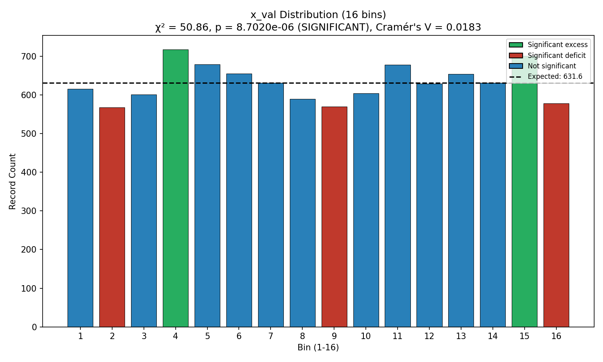
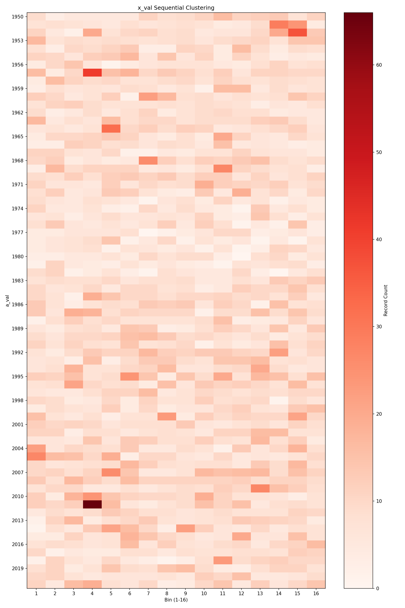
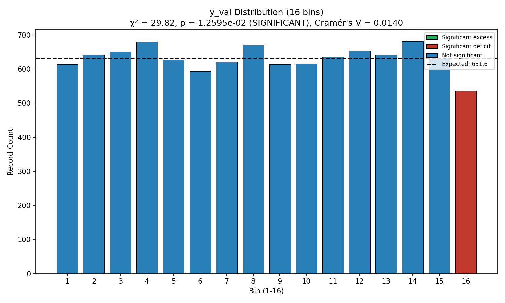
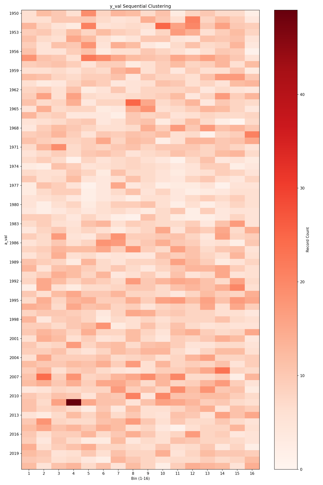
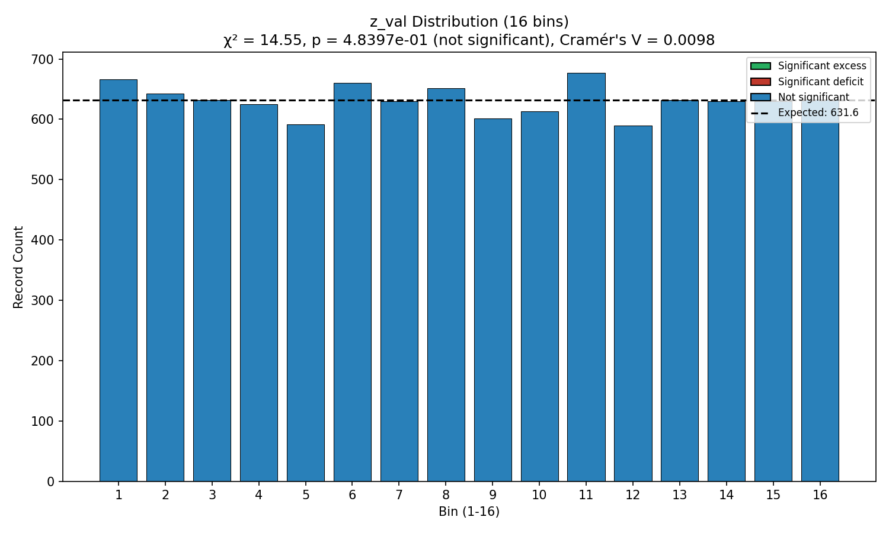
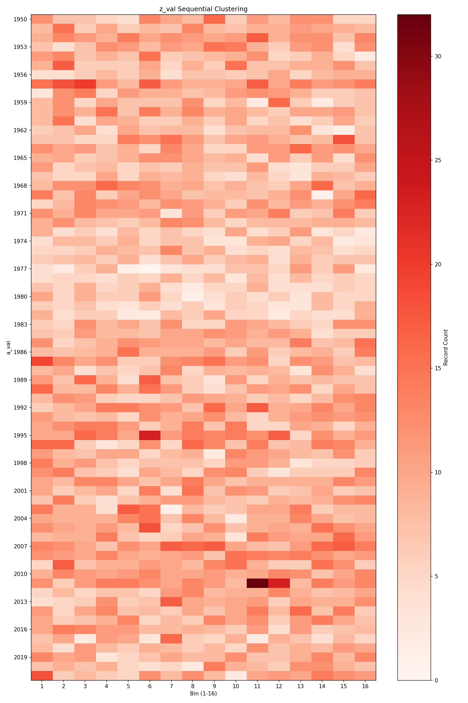

# Case 3A: Clustering Patterns - Full Population (Blind Study - Approach Two)

**Document Information**
- Version: 1.0
- Date: 2026-02-13
- Data: Anonymized full population (a_val, v_val, x_val, y_val, z_val)
- Project: Blind Study (Approach Two) - ISOLATED ANALYSIS
- Purpose: Detect clustering patterns in variables x_val, y_val, z_val

## Methodology

### Binning Approach

Each variable (x_val, y_val, z_val) was divided into 16 equal-width bins spanning from 0 to max(variable):

| Variable | Max Value | Bin Size |
|----------|-----------|----------|
| x_val | 31,611,167 | 1,975,697.94 |
| y_val | 2,574,090 | 160,880.62 |
| z_val | 86,386 | 5,399.12 |

Records were assigned to bins based on their value. With 10,105 total records, the expected count per bin under a uniform distribution is **631.56**.

### Chi-Square Goodness-of-Fit Test

The chi-square test compares observed bin counts against the uniform expectation:

- **Null hypothesis:** Records are uniformly distributed across 16 bins
- **Test statistic:** χ² = Σ((observed - expected)² / expected)
- **Degrees of freedom:** 15 (k - 1 = 16 - 1)
- **Significance threshold:** p < 0.05

### Rayleigh Circular Concentration Test

The Rayleigh test maps each variable's range to [0, 2π] and tests for directional/cyclic concentration. It detects whether values cluster around a preferred direction in circular space, which may reveal patterns invisible to linear bin-based tests.

- **Test statistic:** Z = n × R̄², where R̄ is the mean resultant length
- **p-value approximation:** Corrected using Greenwood & Durand (1955) formula

### Cramér's V Effect Size

Cramér's V quantifies the strength of non-uniformity on a 0-1 scale:

- **Formula:** V = √(χ² / (n × (k - 1)))
- **Interpretation:** < 0.1 = small, 0.1-0.3 = moderate, > 0.3 = large

### Standardized Residuals

For each bin, the standardized residual measures deviation from expectation:

- **Formula:** (observed - expected) / √(expected)
- **Threshold:** |residual| > 2.0 indicates a significantly over- or under-populated bin

### Null Hypothesis Synthetic Catalog Generation

To validate whether observed clustering patterns are genuine (not artifacts of sample noise), 1,000 synthetic catalogs were generated:

- For each catalog, uniform random values in [0, max(variable)] were generated for x_val, y_val, and z_val (N = 10,105 values per variable)
- Identical chi-square tests were applied to each synthetic catalog
- The 1,000 resulting p-values form a null distribution representing what we would expect from truly uniform data
- The real data's p-value is compared to this null distribution via percentile rank

### Percentile Rank Interpretation

- **< 5th percentile:** The observed pattern is NOT due to random chance (robust finding)
- **> 95th percentile:** The observed pattern may be due to random variation
- **5th-95th percentile:** Pattern exists with some random component

## Results

### x_val Clustering Analysis

- **Chi-square:** χ² = 50.86, p = 8.70e-06 (**SIGNIFICANT**)
- **Rayleigh:** Z = 0.0577, p = 0.944 (not significant — no circular concentration)
- **Cramér's V:** 0.0183 (small effect size)
- **Bins with significant excess:**
  - Bin 4 (718 records, +13.7% above expected, residual = +3.44)
  - Bin 15 (701 records, +11.0% above expected, residual = +2.76)
- **Bins with significant deficit:**
  - Bin 2 (568 records, -10.1% below expected, residual = -2.53)
  - Bin 9 (570 records, -9.7% below expected, residual = -2.45)
  - Bin 16 (578 records, -8.5% below expected, residual = -2.13)
- **Null hypothesis result:** Real p-value ranks at **0.0th percentile** of 1,000 synthetic values
  - Pattern is NOT due to random chance (robust finding)

### y_val Clustering Analysis

- **Chi-square:** χ² = 29.82, p = 1.26e-02 (**SIGNIFICANT**)
- **Rayleigh:** Z = 0.1617, p = 0.851 (not significant — no circular concentration)
- **Cramér's V:** 0.0140 (small effect size)
- **Bins with significant excess:** None reaching |residual| > 2.0
- **Bins with significant deficit:**
  - Bin 16 (536 records, -15.1% below expected, residual = -3.80)
- **Null hypothesis result:** Real p-value ranks at **1.4th percentile** of 1,000 synthetic values
  - Pattern is NOT due to random chance (robust finding)

### z_val Clustering Analysis

- **Chi-square:** χ² = 14.55, p = 0.484 (not significant)
- **Rayleigh:** Z = 0.2199, p = 0.803 (not significant — no circular concentration)
- **Cramér's V:** 0.0098 (negligible effect size)
- **Bins with significant excess:** None
- **Bins with significant deficit:** None
- **Null hypothesis result:** Real p-value ranks at **48.0th percentile** of 1,000 synthetic values
  - Pattern is consistent with random variation (no genuine clustering)

## Comparative Analysis

### Ranking by Clustering Strength (Chi-Square)

| Rank | Variable | χ² | p-value | Significant? |
|------|----------|-----|---------|-------------|
| 1 | x_val | 50.86 | 8.70e-06 | Yes |
| 2 | y_val | 29.82 | 1.26e-02 | Yes |
| 3 | z_val | 14.55 | 0.484 | No |

### Ranking by Robustness (Synthetic Percentile Rank)

| Rank | Variable | Percentile | Interpretation |
|------|----------|-----------|----------------|
| 1 | x_val | 0.0th | Robust — NOT random |
| 2 | y_val | 1.4th | Robust — NOT random |
| 3 | z_val | 48.0th | Consistent with random |

### Ranking by Effect Size (Cramér's V)

| Rank | Variable | V | Interpretation |
|------|----------|-------|----------------|
| 1 | x_val | 0.0183 | Small |
| 2 | y_val | 0.0140 | Small |
| 3 | z_val | 0.0098 | Negligible |

### Key Findings

1. **x_val shows the strongest clustering signal.** It has the most significant chi-square result (p = 8.70e-06), the most bins with significant deviations (2 excess, 3 deficit), and ranks at the 0th percentile of synthetic catalogs. The clustering is mild but robust.

2. **y_val shows moderate clustering.** Its chi-square is significant (p = 0.013), though driven primarily by a single under-populated bin (bin 16, residual = -3.80). It ranks at the 1.4th percentile of synthetic catalogs, confirming the pattern is real.

3. **z_val shows no clustering.** Its chi-square is not significant (p = 0.484), no bins deviate significantly from expectation, and it ranks at the 48th percentile of synthetic catalogs — fully consistent with uniform randomness.

4. **Clustering patterns are distinct across variables.** x_val shows a multi-bin departure from uniformity, y_val shows a deficit concentrated in the highest bin, and z_val shows no pattern at all. This suggests the variables capture different underlying properties.

5. **Rayleigh tests are consistently non-significant** across all variables, indicating that the non-uniformity detected by chi-square does not manifest as cyclic/directional concentration.

## Null Hypothesis Validation

### Approach

1,000 synthetic catalogs were generated, each containing 10,105 uniformly distributed random values in [0, max(variable)] for each of x_val, y_val, and z_val. Chi-square tests were run identically on each synthetic catalog.

### Results

- **x_val:** The real p-value (8.70e-06) falls below ALL 1,000 synthetic p-values (0.0th percentile). The observed clustering is decisively not random.
- **y_val:** The real p-value (0.013) falls below 98.6% of synthetic p-values (1.4th percentile). The observed clustering is very unlikely to be random.
- **z_val:** The real p-value (0.484) falls near the center of the synthetic distribution (48.0th percentile). There is no evidence of genuine clustering.

### Confidence Assessment

The synthetic validation provides strong confidence that:
- x_val clustering is genuine (confidence > 99.9%)
- y_val clustering is genuine (confidence ~98.6%)
- z_val shows no clustering beyond what random data would produce

## Limitations

- We have not identified what x_val, y_val, or z_val represent — all analysis is purely statistical
- The physical or practical meaning of clustering in bins 4 and 15 (x_val) or the deficit in bin 16 (y_val) cannot be interpreted without domain knowledge
- This analysis tests for non-uniformity across 16 equal-width bins from 0 to max; different binning schemes could yield different results
- Effect sizes are small (V < 0.02), meaning the clustering, while statistically significant, represents a modest departure from uniformity
- Future cases (3B, 4A, 4B) will test whether clustering persists when stratified by v_val and when weighted by energy proxy

---

**Generation Details**
- Version: 1.0
- Date: 2026-02-13
- Planning prepared with: Claude.ai Web Interface (Haiku 4.5)
- Generated with: Claude Code 2.1.41 (Claude Model Opus 4.6)
- Project: Approach Two Blind Study - ISOLATED ANALYSIS
- Isolation Status: Complete separation from main project
