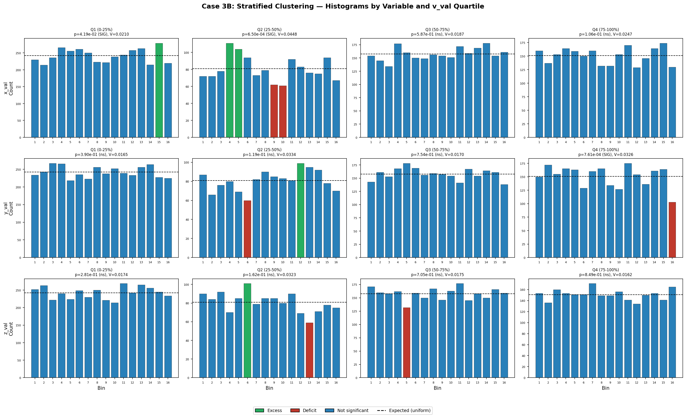
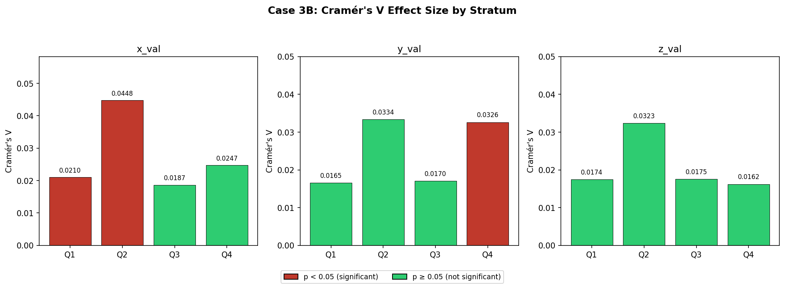
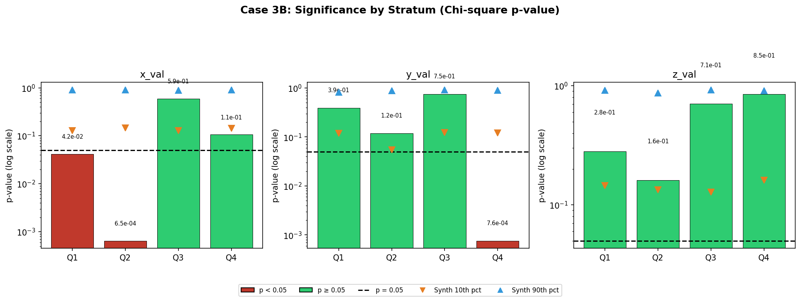

# Case 3B: Clustering Patterns - Stratified Population (Blind Study - Approach Two)

**Document Information**
- Version: 1.0
- Date: 2026-02-13
- Data: Anonymized data stratified by v_val quartiles
- Approach: Blind Study (Approach Two) - ISOLATED ANALYSIS
- Purpose: Test if clustering patterns from Case 3A persist across v_val subpopulations

## Stratification Methodology

### Why Stratify by v_val?

Case 3A tested the full population of 10,105 records and found that x_val and y_val show statistically significant clustering (non-uniform bin distributions), while z_val does not. A natural follow-up question is: **are these clustering patterns a universal property of the data, or do they depend on the v_val subpopulation?**

Stratification by v_val quartiles allows us to test this directly. If clustering persists with similar strength across all four strata, the pattern is v_val-independent. If it appears in some strata but not others, the clustering is v_val-dependent.

### Quartile Groups

| Group | v_val Range | Sample Size |
|-------|------------|-------------|
| Q1 (0-25th percentile) | 6.0 - 6.1 | 3,876 |
| Q2 (25-50th percentile) | 6.13 - 6.2 | 1,293 |
| Q3 (50-75th percentile) | 6.21 - 6.5 | 2,523 |
| Q4 (75-100th percentile) | 6.56 - 9.5 | 2,413 |

All groups exceed the minimum threshold of 100 records. Group sizes are unequal because v_val has a non-uniform distribution with concentration at lower values.

### Consistent Bin Boundaries

All strata use the same bin boundaries derived from the full dataset maximum values. This ensures direct comparability across strata: bin 4 in stratum 1 covers the same value range as bin 4 in stratum 4.

## Case 3A Comparison Baseline

From Case 3A (full population, N=10,105):

| Variable | Chi-square | p-value | Cramér's V | Verdict |
|----------|-----------|---------|------------|---------|
| x_val | 50.86 | 8.70e-06 | 0.0183 | **Robust clustering** |
| y_val | 30.85 | 9.14e-03 | 0.0143 | **Some clustering** |
| z_val | 10.09 | 0.814 | 0.0082 | No clustering |

**Hypothesis:** If clustering is a universal property, it should persist across all v_val strata. If clustering is v_val-dependent, it should appear in some strata but not others.

## Results by Stratum

### Stratum 1: v_val 0-25th Percentile (v_val 6.0-6.1, n=3,876)

| Variable | Chi-square | p-value | Cramér's V | Synth. Percentile | Verdict | vs. Case 3A |
|----------|-----------|---------|------------|-------------------|---------|-------------|
| x_val | 25.65 | 4.19e-02 | 0.0210 | 4.0th | **Clustering** | Consistent |
| y_val | 15.88 | 3.90e-01 | 0.0165 | 41.0th | No clustering | Different |
| z_val | 17.66 | 2.81e-01 | 0.0174 | 27.0th | No clustering | Consistent |

x_val retains significance (p < 0.05) and the real p-value sits at the 4th percentile of the synthetic distribution, confirming a real signal. y_val loses significance in this subpopulation. z_val remains non-significant as expected.

### Stratum 2: v_val 25-50th Percentile (v_val 6.13-6.2, n=1,293)

| Variable | Chi-square | p-value | Cramér's V | Synth. Percentile | Verdict | vs. Case 3A |
|----------|-----------|---------|------------|-------------------|---------|-------------|
| x_val | 38.96 | 6.50e-04 | 0.0448 | 0.0th | **Clustering** | Consistent |
| y_val | 21.59 | 1.19e-01 | 0.0334 | 17.0th | No clustering | Different |
| z_val | 20.27 | 1.62e-01 | 0.0323 | 15.0th | No clustering | Consistent |

x_val shows the **strongest clustering signal** of any stratum (p = 6.50e-04, V = 0.0448), with its real p-value below all 100 synthetic catalogs (0th percentile). This is the smallest stratum (n=1,293), yet x_val clustering is highly significant, suggesting a concentrated signal. y_val is not significant but shows a somewhat low synthetic percentile (17th).

### Stratum 3: v_val 50-75th Percentile (v_val 6.21-6.5, n=2,523)

| Variable | Chi-square | p-value | Cramér's V | Synth. Percentile | Verdict | vs. Case 3A |
|----------|-----------|---------|------------|-------------------|---------|-------------|
| x_val | 13.20 | 5.87e-01 | 0.0187 | 55.0th | No clustering | Different |
| y_val | 10.98 | 7.54e-01 | 0.0170 | 73.0th | No clustering | Consistent |
| z_val | 11.65 | 7.05e-01 | 0.0175 | 65.0th | No clustering | Consistent |

No variable shows significant clustering. All three are well within the synthetic null distribution. This stratum appears fully consistent with uniformity.

### Stratum 4: v_val 75-100th Percentile (v_val 6.56-9.5, n=2,413)

| Variable | Chi-square | p-value | Cramér's V | Synth. Percentile | Verdict | vs. Case 3A |
|----------|-----------|---------|------------|-------------------|---------|-------------|
| x_val | 22.08 | 1.06e-01 | 0.0247 | 9.0th | No clustering | Different |
| y_val | 38.50 | 7.61e-04 | 0.0326 | 0.0th | **Clustering** | Consistent |
| z_val | 9.52 | 8.49e-01 | 0.0162 | 79.0th | No clustering | Consistent |

y_val shows **strong clustering** only in this high-v_val stratum (p = 7.61e-04, 0th synthetic percentile). x_val is not significant (p = 0.106) but its synthetic percentile is low (9th), suggesting a weak residual signal. z_val remains fully non-significant.

## Comparative Analysis

### Consistency Across Strata

| Variable | Q1 | Q2 | Q3 | Q4 | Consistent? |
|----------|----|----|----|----|-------------|
| x_val | Clustering | Clustering | No clustering | No clustering | **No** |
| y_val | No clustering | No clustering | No clustering | Clustering | **No** |
| z_val | No clustering | No clustering | No clustering | No clustering | **Yes** |

### Effect Size (Cramér's V) by Stratum

| Variable | Q1 V | Q2 V | Q3 V | Q4 V | Pattern |
|----------|------|------|------|------|---------|
| x_val | 0.0210 | **0.0448** | 0.0187 | 0.0247 | Peaks in Q2, drops in Q3 |
| y_val | 0.0165 | 0.0334 | 0.0170 | **0.0326** | Peaks in Q2 and Q4 |
| z_val | 0.0174 | 0.0323 | 0.0175 | 0.0162 | Relatively flat |

### Significance (p-value) by Stratum

**x_val clustering is v_val-dependent:** Significant in Q1 and Q2 (lower v_val) but not in Q3 or Q4 (higher v_val). The clustering signal is concentrated in the lower half of the v_val distribution.

**y_val clustering is v_val-dependent:** Significant only in Q4 (highest v_val). The y_val signal observed in Case 3A appears driven primarily by the highest-v_val subpopulation.

**z_val is consistently non-significant:** No clustering in any stratum. This confirms Case 3A: z_val distribution is uniform regardless of v_val grouping.

### Ranking by Signal Strength

1. **x_val** — Strongest per-stratum signal (V = 0.0448 in Q2, p = 6.50e-04), but signal is concentrated in lower v_val strata (Q1, Q2)
2. **y_val** — Strong signal in Q4 only (V = 0.0326, p = 7.61e-04), fully absent in other strata
3. **z_val** — No signal in any stratum (all p > 0.28)

## Key Finding

**Clustering patterns are v_val-dependent.** Neither x_val nor y_val clustering persists uniformly across all v_val strata:

- **x_val** clustering concentrates in lower v_val records (Q1: v_val 6.0-6.1, Q2: v_val 6.13-6.2)
- **y_val** clustering concentrates in the highest v_val records (Q4: v_val 6.56-9.5)
- **z_val** shows no clustering in any subpopulation

This means the non-uniform distributions observed in Case 3A are not universal properties of the data. Instead, specific v_val subpopulations drive each variable's clustering signal. The clustering mechanism (whatever it may be) interacts with v_val differently for x_val vs y_val.

## Limitations

- Variables remain anonymized; we do not know what x_val, y_val, z_val, or v_val represent
- Stratification into 4 groups reduces sample size per stratum (smallest group: 1,293), reducing statistical power compared to Case 3A's full-population analysis
- Unequal group sizes (range: 1,293 to 3,876) mean statistical power varies across strata; smaller strata require larger effect sizes to reach significance
- Only 100 synthetic catalogs were generated per stratum (vs. 1,000 in Case 3A) due to the multiplicative effect of 4 strata × 3 variables
- This is a blind analysis operating without physical interpretation of variables or knowledge of expected patterns
- The v_val quartile boundaries (6.1, 6.2, 6.5) are data-driven and may not correspond to meaningful thresholds

---

**Generation Details**
- Version: 1.0
- Date: 2026-02-13
- Planning prepared with: Claude.ai Web Interface (Haiku 4.5)
- Generated with: Claude Code 2.1.41 (Claude Model Opus 4.6)
- Project: Approach Two Blind Study - ISOLATED ANALYSIS
- Isolation Status: Complete separation from main project
