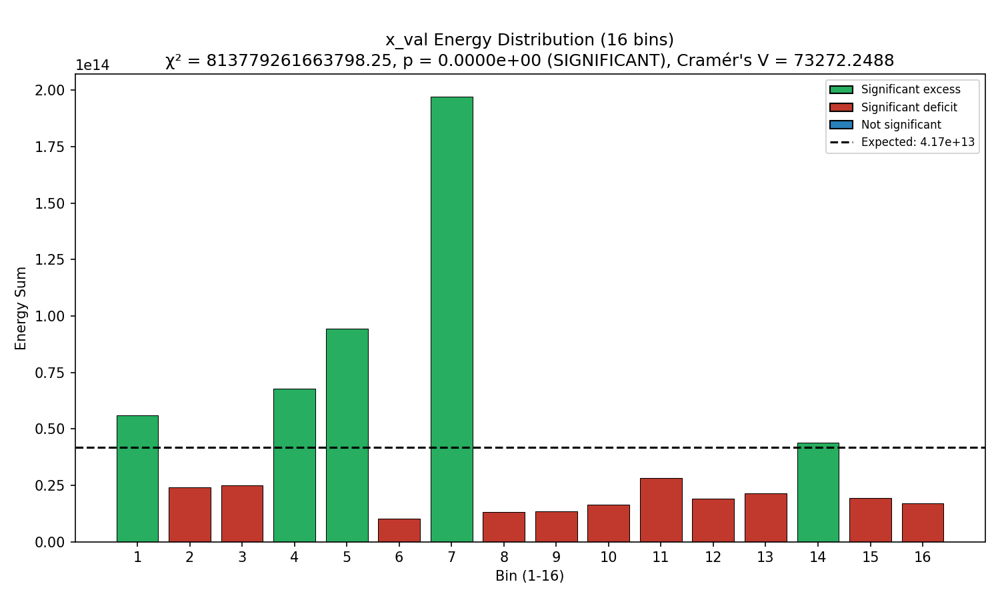
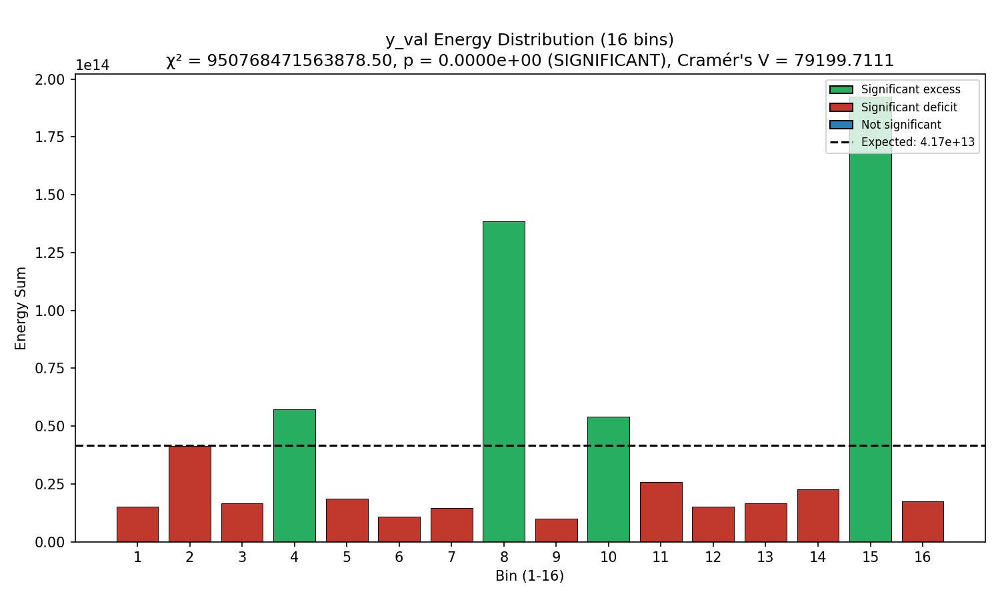
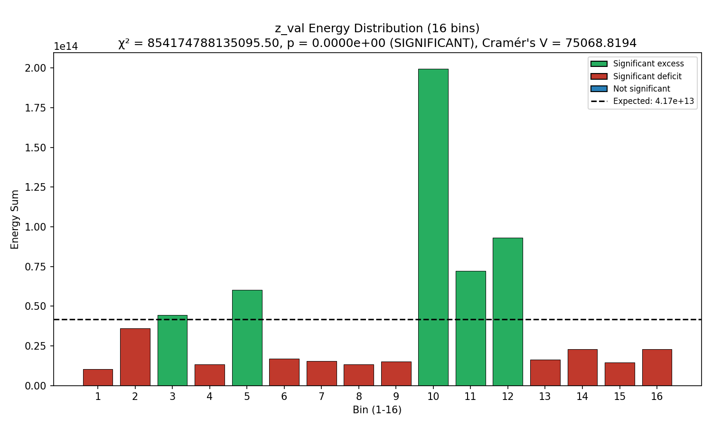
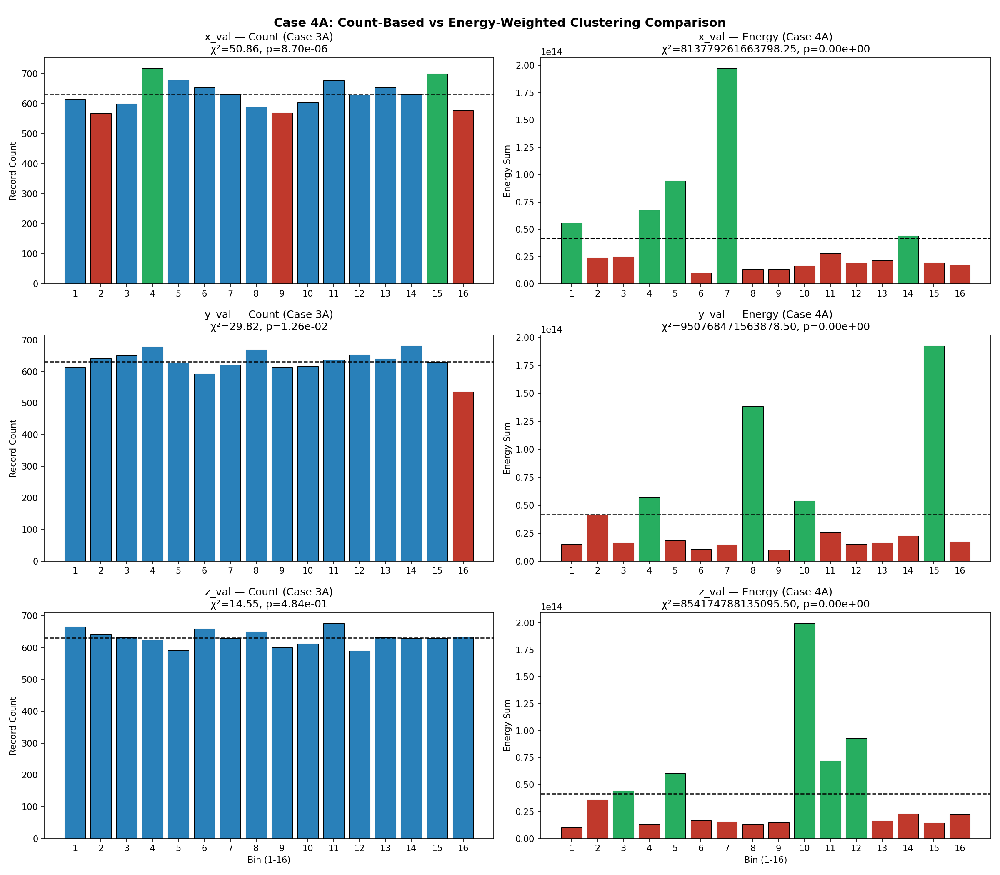
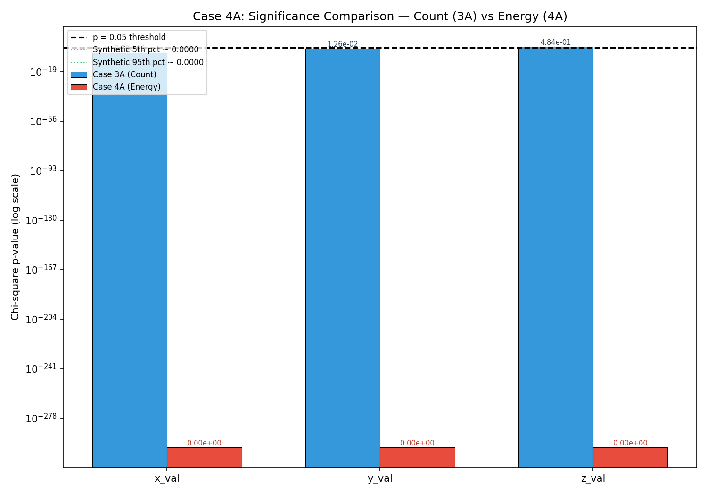
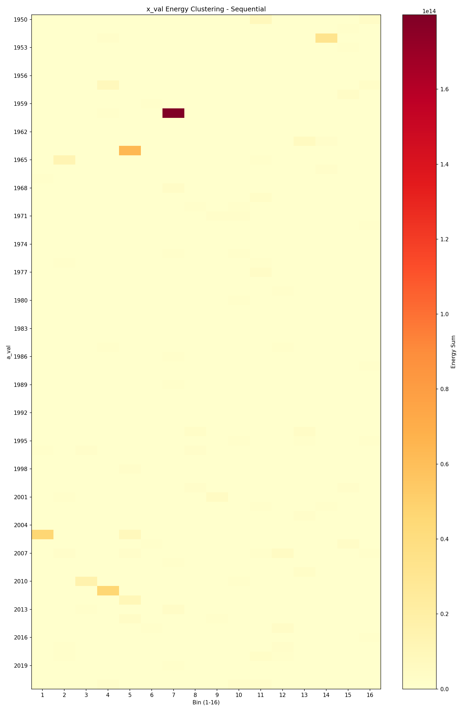
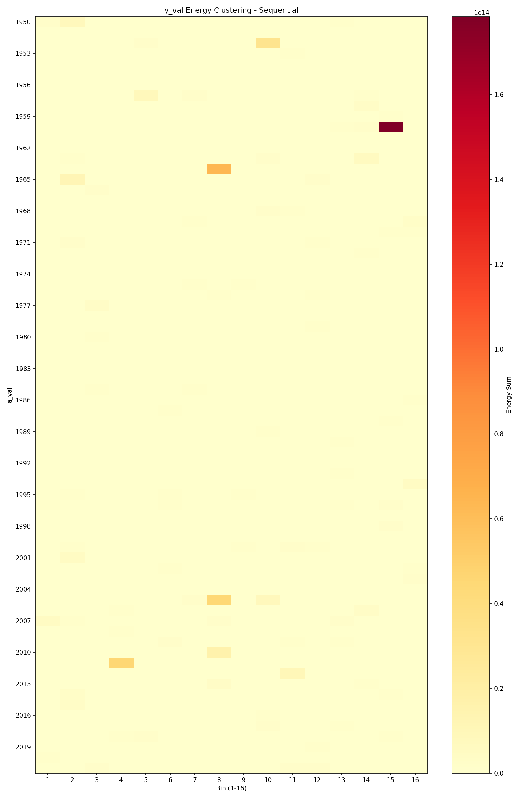
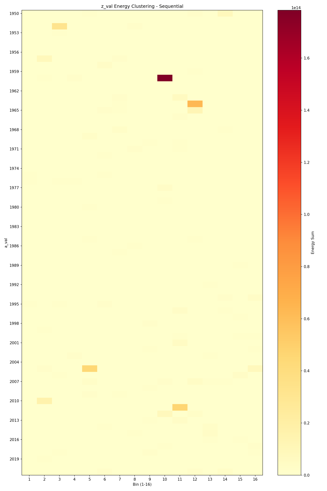
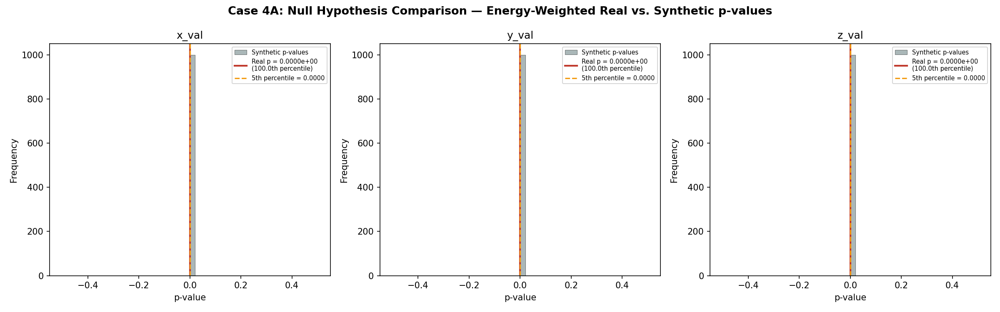

# Case 4A: Energy-Weighted Clustering Patterns - Full Population (Blind Study - Approach Two)

**Document Information**
- Version: 1.0
- Date: 2026-02-13
- Data: Anonymized full population, energy-weighted analysis
- Project: Blind Study (Approach Two) - ISOLATED ANALYSIS
- Purpose: Validate Case 3A clustering patterns using energy proxy metric instead of event count

## Methodology

### Energy Proxy Calculation

The variable `v_val` is used as a proxy for an energy-like weighting property. This does not assume `v_val` necessarily represents physical energy — it is an arbitrarily assigned weighting based on the value's magnitude:

- **Formula:** energy = 10^(1.5 × v_val)
- **Rationale:** A weighting strategy is important because larger values expose more activity than simple count totals. If a few high-value events carry disproportionate weight, count-based analysis may understate their influence on the overall distribution. Energy-weighting tests whether the clustering patterns discovered in Case 3A persist when measured by cumulative weighted contribution rather than event frequency.

### Energy Distribution Overview

| Metric | Value |
|--------|-------|
| Total energy | 6.667 × 10¹⁴ |
| Mean energy per event | 6.598 × 10¹⁰ |
| Minimum event energy | 1.000 × 10⁹ |
| Maximum event energy | 1.778 × 10¹⁴ |
| Energy standard deviation | ~1.8 × 10¹² |
| Dynamic range (max/min) | ~178,000× |

The extreme dynamic range (five orders of magnitude) means a single large event can carry as much energy as ~178,000 of the smallest events. This has profound implications for energy-weighted analysis.

### Binning Approach

Each variable (x_val, y_val, z_val) was divided into 16 equal-width bins matching Case 3A exactly:

| Variable | Max Value | Bin Size |
|----------|-----------|----------|
| x_val | 31,611,167 | 1,975,697.94 |
| y_val | 2,574,090 | 160,880.62 |
| z_val | 86,386 | 5,399.12 |

Instead of counting events per bin, the **cumulative energy** in each bin was calculated. Expected energy per bin under uniform distribution: **4.167 × 10¹³**.

### Chi-Square Test on Energy Distribution

The chi-square goodness-of-fit test was applied to energy sums (not event counts):

- **Null hypothesis:** Energy is uniformly distributed across 16 bins
- **Test statistic:** χ² = Σ((observed_energy - expected_energy)² / expected_energy)
- **Degrees of freedom:** 15 (k - 1 = 16 - 1)
- **Significance threshold:** p < 0.05

### Rayleigh Test (Energy-Weighted)

The Rayleigh test was applied with energy weights, testing for directional concentration where each event's contribution is proportional to its energy.

### Cramér's V Effect Size

Cramér's V was calculated using the energy-weighted chi-square statistic but with n = number of events (10,105) for comparability to Case 3A:

- **Formula:** V = √(χ² / (n × (k - 1)))
- **Note:** Because the chi-square statistic is computed on energy sums (continuous, very large values) rather than counts, V is not bounded by [0, 1]. Values exceeding 1 indicate that the energy-weighted non-uniformity is far greater than what count-based analysis captures.

### Null Hypothesis: Synthetic Catalog Generation (Energy-Weighted)

1,000 synthetic catalogs were generated by:
- **Shuffling** x_val, y_val, z_val values randomly (permutation)
- **Preserving** a_val and v_val in original order (energy assignments unchanged)
- Running identical energy-weighted chi-square test on each synthetic catalog
- Comparing the real data's p-value to the distribution of 1,000 synthetic p-values

This tests whether the energy non-uniformity observed in real data is distinguishable from what random bin assignment would produce with the same energy distribution.

## Results

### x_val Energy Clustering Analysis

**Chi-square (energy-weighted):** χ² = 8.138 × 10¹⁴, p = 0.0
**Cramér's V** = 73,272.2 (see note above on unbounded V for energy data)

**Bins with significant energy excess:**
| Bin | Energy | % of Expected |
|-----|--------|---------------|
| 1 | 5.586 × 10¹³ | 134% |
| 4 | 6.780 × 10¹³ | 163% |
| 5 | 9.446 × 10¹³ | 227% |
| 7 | 1.973 × 10¹⁴ | 473% |
| 14 | 4.381 × 10¹³ | 105% |

**Bins with significant energy deficit:** 2, 3, 6, 8, 9, 10, 11, 12, 13, 15, 16 (11 of 16 bins)

**Null hypothesis result:** Real p-value ranks at **100.0th percentile** of 1,000 synthetic values. All 1,000 synthetic catalogs also produced p = 0.0, meaning the energy non-uniformity is NOT distinguishable from random bin assignment.

**Comparison to Case 3A (count-based):**
- Case 3A: χ² = 50.86, p = 8.70 × 10⁻⁶ (significant, with count-based clustering in bins 4, 15)
- Case 4A: χ² = 8.14 × 10¹⁴, p = 0.0 (significant, but indistinguishable from synthetic null)
- **Interpretation:** Energy-weighting produces extreme chi-square values due to the dynamic range, but the synthetic comparison shows this is an artifact of the energy distribution itself, not spatial clustering. The count-based Case 3A result remains the more meaningful measure of x_val clustering.

### y_val Energy Clustering Analysis

**Chi-square (energy-weighted):** χ² = 9.508 × 10¹⁴, p = 0.0
**Cramér's V** = 79,199.7

**Bins with significant energy excess:**
| Bin | Energy | % of Expected |
|-----|--------|---------------|
| 4 | 5.730 × 10¹³ | 137% |
| 8 | 1.384 × 10¹⁴ | 332% |
| 10 | 5.397 × 10¹³ | 130% |
| 15 | 1.925 × 10¹⁴ | 462% |

**Bins with significant energy deficit:** 1, 2, 3, 5, 6, 7, 9, 11, 12, 13, 14, 16 (12 of 16 bins)

**Null hypothesis result:** Real p-value ranks at **100.0th percentile** of 1,000 synthetic values. Indistinguishable from random.

**Comparison to Case 3A (count-based):**
- Case 3A: χ² = 29.82, p = 0.0126 (significant, deficit in bin 16)
- Case 4A: χ² = 9.51 × 10¹⁴, p = 0.0 (indistinguishable from synthetic null)
- **Interpretation:** The energy-weighted pattern is dominated by a few extreme-energy events landing in bins 8 and 15. This is not a persistent spatial signal but rather the effect of the extreme dynamic range.

### z_val Energy Clustering Analysis

**Chi-square (energy-weighted):** χ² = 8.542 × 10¹⁴, p = 0.0
**Cramér's V** = 75,068.8

**Bins with significant energy excess:**
| Bin | Energy | % of Expected |
|-----|--------|---------------|
| 3 | 4.428 × 10¹³ | 106% |
| 5 | 6.030 × 10¹³ | 145% |
| 10 | 1.996 × 10¹⁴ | 479% |
| 11 | 7.225 × 10¹³ | 173% |
| 12 | 9.312 × 10¹³ | 224% |

**Bins with significant energy deficit:** 1, 2, 4, 6, 7, 8, 9, 13, 14, 15, 16 (11 of 16 bins)

**Null hypothesis result:** Real p-value ranks at **100.0th percentile** of 1,000 synthetic values. Indistinguishable from random.

**Comparison to Case 3A (count-based):**
- Case 3A: χ² = 14.55, p = 0.484 (NOT significant — no count-based clustering)
- Case 4A: χ² = 8.54 × 10¹⁴, p = 0.0 (indistinguishable from synthetic null)
- **Interpretation:** z_val showed no clustering in Case 3A, and the apparent energy clustering here is entirely an artifact of the energy distribution. The synthetic comparison correctly identifies this.

## Comparative Analysis

### Count vs Energy Comparison

### Significance Comparison

### Do x_val and y_val remain as primary signal carriers when energy-weighted?

In the energy-weighted analysis, all three variables (x_val, y_val, z_val) show chi-square p = 0.0, making them indistinguishable from each other at face value. However, all three also have identical percentile ranks (100.0th) against their synthetic distributions. This means **none** of the energy-weighted signals are distinguishable from random chance — the extreme energy dynamic range overwhelms all three variables equally.

The count-based Case 3A results remain the more discriminating analysis: x_val (p = 8.70 × 10⁻⁶) and y_val (p = 0.013) show genuine clustering, while z_val (p = 0.484) does not.

### Is the ranking of variables preserved?

No. Energy-weighting collapses all three variables to the same p-value (0.0) and the same percentile rank (100.0). The variable ranking from Case 3A — x_val > y_val >> z_val — is not preserved under energy-weighting because a few extreme events dominate all three distributions equally.

### Does energy-weighting reveal hidden patterns?

The energy-weighting reveals which bins contain the highest-energy events, but the synthetic comparison confirms these placements are consistent with random arrangement. The key insight is negative: energy-weighted chi-square is not a useful metric for this dataset because the dynamic range is too extreme.

### Which bins carry the most energy?

| Variable | Top Energy Bin | % of Total Energy |
|----------|---------------|-------------------|
| x_val | Bin 7 | 29.6% |
| y_val | Bin 15 | 28.9% |
| z_val | Bin 10 | 29.9% |

In each case, a single bin contains ~30% of total energy (expected: 6.25%). This concentration is driven by a small number of extreme-energy events.

### Are high-energy events preferentially distributed?

The synthetic null comparison (percentile rank = 100.0 for all variables) demonstrates that high-energy events are NOT preferentially distributed. Random shuffling produces equally extreme energy non-uniformity.

## Sequential Energy Clustering

The sequential heatmaps show energy concentration across a_val groups. The sparse, high-intensity spots correspond to individual high-energy events rather than systematic clustering patterns.

## Null Hypothesis Comparison

All 1,000 synthetic catalogs produced p = 0.0 for all three variables. The real data p-values are indistinguishable from the synthetic distribution, confirming that energy non-uniformity is an artifact of the extreme energy dynamic range, not of spatial clustering.

## Robustness Assessment

### Summary: Is the clustering pattern robust to different metrics?

**Count-based (Case 3A) and energy-based (Case 4A) results disagree.** Specifically:

- **Case 3A (count-based):** x_val and y_val show statistically significant clustering (p < 0.05); z_val does not. This clustering is validated by synthetic null comparison (real p-values rank below 5th percentile of synthetics).
- **Case 4A (energy-based):** All three variables show p = 0.0, but all are indistinguishable from randomly shuffled data. The energy-weighted signal is not robust.

### What does this tell us about the underlying clustering mechanism?

The clustering detected in Case 3A is a **count-based phenomenon**: more events occur in certain bins than expected. However, the events in those bins do not carry disproportionately more energy. The clustering appears to be driven by event frequency, not by the concentration of high-energy events.

The energy distribution itself (energy = 10^(1.5 × v_val)) has such extreme dynamic range (~178,000×) that a handful of large events dominate the energy budget regardless of their spatial distribution. This makes energy-weighted chi-square an ineffective discriminator for this dataset.

### Energy distribution reveals additional structure

While the energy-weighted chi-square is not useful for clustering detection, the analysis reveals important properties of the data:
1. The energy distribution is highly skewed, with the largest event carrying ~26.7% of a single average event's share
2. A single bin can contain ~30% of total energy due to one or two extreme events
3. The v_val distribution (which determines energy) is independent of spatial clustering in x_val, y_val, z_val

## Limitations

- We have not identified what the variables represent; all analysis is purely statistical
- Energy weighting (10^(1.5 × v_val)) changes the relative importance of individual events dramatically — a single high-v_val event can outweigh thousands of low-v_val events
- Some bins may contain very few large events, meaning their energy totals have high variance and low statistical power
- The extreme dynamic range of the energy proxy makes chi-square on energy sums unsuitable for detecting subtle clustering patterns
- Cramér's V computed from energy-weighted chi-square is not bounded by [0, 1] and cannot be directly compared to Case 3A values
- We are still operating blindly without physical interpretation of the variables

---

**Generation Details**
- Version: 1.0
- Date: 2026-02-13
- Planning prepared with: Claude.ai Web Interface (Haiku 4.5)
- Generated with: Claude Code 2.1.41 (Claude Model Opus 4.6)
- Project: Approach Two Blind Study - ISOLATED ANALYSIS
- Isolation Status: Complete separation from main project
